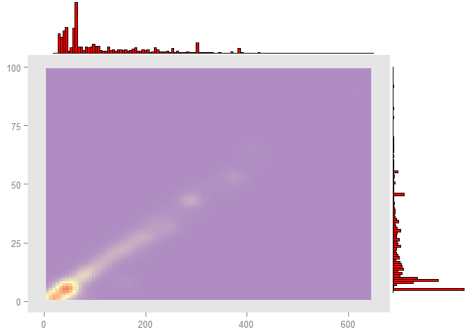
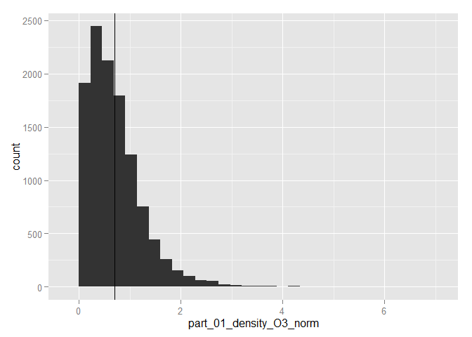

1.  [Kod wyliczający wykorzystane biblioteki](#kod1)
2.  [Kod pozwalający wczytać dane z pliku](#kod2)
3.  [Kod usuwający z danych wiersze posiadające wartość zmiennej res\_name równą: “DA”,“DC”,“DT”, “DU”, “DG”, “DI”,“UNK”, “UNX”, “UNL”, “PR”, “PD”, “Y1”, “EU”, “N”, “15P”, “UQ”, “PX4” lub “NAN”](#kod3)
4.  [Kod pozostawiający tylko unikatowe pary wartości (pdb\_code, res\_name) + dodatkowe zestawy danych do dalszych zadań](#kod4)
5.  [Krótkie podsumowanie wartości w każdej kolumnie](#kod5)
6.  [Sekcja sprawdzającą korelacje między zmiennymi](#kod6)
7.  [Określenie ile przykładów ma każda z klas (res\_name)](#kod7)
8.  [Wykresy rozkładów liczby atomów (local\_res\_atom\_non\_h\_count) i elektronów (local\_res\_atom\_non\_h\_electron\_sum)](#kod8)
9.  [Próba odtworzenia wykresu (oś X - liczba elektronów, oś y - liczba atomów)](#kod9)
10. [Tabela pokazującą 10 klas z największą niezgodnością liczby atomów (local\_res\_atom\_non\_h\_count vs dict\_atom\_non\_h\_count) i tabelę pokazującą 10 klas z największą niezgodnością liczby elektronów (local\_res\_atom\_non\_h\_electron\_sum vs dict\_atom\_non\_h\_electron\_sum;)](#kod10)
11. [Sekcja pokazującą rozkład wartości wszystkich kolumn zaczynających się od part\_01 z zaznaczeniem (graficznym i liczbowym) średniej wartości;](#kod11)
12. [Sekcja sprawdzającą czy na podstawie wartości innych kolumn można przewidzieć liczbę elektronów i atomów oraz z jaką dokładnością można dokonać takiej predykcji; trafność regresji powinna zostać oszacowana na podstawie miar R^2 i RMSE;](#kod12)
13. [Sekcja próbującą stworzyć klasyfikator przewidujący wartość atrybutu res\_name (w tej sekcji należy wykorzystać wiedzę z pozostałych punktów oraz wykonać dodatkowe czynności, które mogą poprawić trafność klasyfikacji); trafność klasyfikacji powinna zostać oszacowana na danych inne niż uczące za pomocą mechanizmu (stratyfikowanej!) oceny krzyżowej lub (stratyfikowanego!) zbioru testowego.](#kod13)

Podsumowanie
============

Nie udało mi się wykonać wszystkich zadań, szczególnie stworzyc klasyfikatora, dlatego zamieściłem jedynie koncepcję. W korelacji wykorzystałem dane bez prefixu partXX. Wykres odwtworzony niestety nie jest dokładnie kopią tego z zadania, ale myślę, że wystarczająco oddaje wizualizację danych. W regresji skorzystałem z summary.lm() w celu wyciągnięcia miar R^2 oraz RMSE.

<div id='kod1'/>
Kod wyliczający wykorzystane biblioteki;
========================================

``` r
library(knitr)
library(dplyr)
library(ggplot2)
library(ggExtra)
library(gridExtra)
library(lattice)
library(corrplot)
library(caret)
```

<div id='kod2'/>
Kod pozwalający wczytać dane z pliku;
=====================================

``` r
data <- read.csv("all_summary.txt", sep =";", header = TRUE)
```

<div id='kod3'/>
Kod usuwający z danych wiersze posiadające wartość zmiennej res\_name równą: “DA”,“DC”,“DT”, “DU”, “DG”, “DI”,“UNK”, “UNX”, “UNL”, “PR”, “PD”, “Y1”, “EU”, “N”, “15P”, “UQ”, “PX4” lub “NAN”;
=============================================================================================================================================================================================

``` r
data <- data %>%
  group_by(res_name) %>%
  filter( !grepl("DA|DI|DC|DT|DU|DG|UNK|UNX|UNL|PR|PD|Y1|EU|N|15P|UQ|PX4|NAN",res_name))
```

<div id='kod4'/>
Kod pozostawiający tylko unikatowe pary wartości (pdb\_code, res\_name) + dodatkowe zestawy danych do dalszych zadań
====================================================================================================================

``` r
data <- data[!duplicated(data[c("pdb_code", "res_name")]),]
nopart_data <- select (data, -starts_with("part"))
part1_data <- select (data, starts_with("part_01"))
part1_data[is.na(part1_data)] <- 0
```

<div id='kod5'/>
Krótkie podsumowanie wartości w każdej kolumnie;
================================================

|     |       title       | pdb\_code |   res\_name  |  res\_id  | chain\_id |  local\_BAa |  local\_NPa |  local\_Ra  |  local\_RGa | local\_SRGa | local\_CCSa | local\_CCPa |  local\_ZOa |  local\_ZDa | local\_ZD\_minus\_a | local\_ZD\_plus\_a | local\_res\_atom\_count | local\_res\_atom\_non\_h\_count | local\_res\_atom\_non\_h\_occupancy\_sum | local\_res\_atom\_non\_h\_electron\_sum | local\_res\_atom\_non\_h\_electron\_occupancy\_sum | local\_res\_atom\_C\_count | local\_res\_atom\_N\_count | local\_res\_atom\_O\_count | local\_res\_atom\_S\_count | dict\_atom\_non\_h\_count | dict\_atom\_non\_h\_electron\_sum | dict\_atom\_C\_count | dict\_atom\_N\_count | dict\_atom\_O\_count | dict\_atom\_S\_count | part\_00\_blob\_electron\_sum | part\_00\_blob\_volume\_sum | part\_00\_blob\_parts | part\_00\_shape\_O3 | part\_00\_shape\_O4 | part\_00\_shape\_O5 | part\_00\_shape\_FL | part\_00\_shape\_O3\_norm | part\_00\_shape\_O4\_norm | part\_00\_shape\_O5\_norm | part\_00\_shape\_FL\_norm | part\_00\_shape\_I1 | part\_00\_shape\_I2 | part\_00\_shape\_I3 | part\_00\_shape\_I4 | part\_00\_shape\_I5 | part\_00\_shape\_I6 | part\_00\_shape\_I1\_norm | part\_00\_shape\_I2\_norm | part\_00\_shape\_I3\_norm | part\_00\_shape\_I4\_norm | part\_00\_shape\_I5\_norm | part\_00\_shape\_I6\_norm | part\_00\_shape\_I1\_scaled | part\_00\_shape\_I2\_scaled | part\_00\_shape\_I3\_scaled | part\_00\_shape\_I4\_scaled | part\_00\_shape\_I5\_scaled | part\_00\_shape\_I6\_scaled | part\_00\_shape\_M000 | part\_00\_shape\_E3\_E1 | part\_00\_shape\_E2\_E1 | part\_00\_shape\_E3\_E2 | part\_00\_shape\_sqrt\_E1 | part\_00\_shape\_sqrt\_E2 | part\_00\_shape\_sqrt\_E3 | part\_00\_density\_O3 | part\_00\_density\_O4 | part\_00\_density\_O5 | part\_00\_density\_FL | part\_00\_density\_O3\_norm | part\_00\_density\_O4\_norm | part\_00\_density\_O5\_norm | part\_00\_density\_FL\_norm | part\_00\_density\_I1 | part\_00\_density\_I2 | part\_00\_density\_I3 | part\_00\_density\_I4 | part\_00\_density\_I5 | part\_00\_density\_I6 | part\_00\_density\_I1\_norm | part\_00\_density\_I2\_norm | part\_00\_density\_I3\_norm | part\_00\_density\_I4\_norm | part\_00\_density\_I5\_norm | part\_00\_density\_I6\_norm | part\_00\_density\_I1\_scaled | part\_00\_density\_I2\_scaled | part\_00\_density\_I3\_scaled | part\_00\_density\_I4\_scaled | part\_00\_density\_I5\_scaled | part\_00\_density\_I6\_scaled | part\_00\_density\_M000 | part\_00\_density\_E3\_E1 | part\_00\_density\_E2\_E1 | part\_00\_density\_E3\_E2 | part\_00\_density\_sqrt\_E1 | part\_00\_density\_sqrt\_E2 | part\_00\_density\_sqrt\_E3 | part\_01\_blob\_electron\_sum | part\_01\_blob\_volume\_sum | part\_01\_blob\_parts | part\_01\_shape\_O3 | part\_01\_shape\_O4 | part\_01\_shape\_O5 | part\_01\_shape\_FL | part\_01\_shape\_O3\_norm | part\_01\_shape\_O4\_norm | part\_01\_shape\_O5\_norm | part\_01\_shape\_FL\_norm | part\_01\_shape\_I1 | part\_01\_shape\_I2 | part\_01\_shape\_I3 | part\_01\_shape\_I4 | part\_01\_shape\_I5 | part\_01\_shape\_I6 | part\_01\_shape\_I1\_norm | part\_01\_shape\_I2\_norm | part\_01\_shape\_I3\_norm | part\_01\_shape\_I4\_norm | part\_01\_shape\_I5\_norm | part\_01\_shape\_I6\_norm | part\_01\_shape\_I1\_scaled | part\_01\_shape\_I2\_scaled | part\_01\_shape\_I3\_scaled | part\_01\_shape\_I4\_scaled | part\_01\_shape\_I5\_scaled | part\_01\_shape\_I6\_scaled | part\_01\_shape\_M000 | part\_01\_shape\_E3\_E1 | part\_01\_shape\_E2\_E1 | part\_01\_shape\_E3\_E2 | part\_01\_shape\_sqrt\_E1 | part\_01\_shape\_sqrt\_E2 | part\_01\_shape\_sqrt\_E3 | part\_01\_density\_O3 | part\_01\_density\_O4 | part\_01\_density\_O5 | part\_01\_density\_FL | part\_01\_density\_O3\_norm | part\_01\_density\_O4\_norm | part\_01\_density\_O5\_norm | part\_01\_density\_FL\_norm | part\_01\_density\_I1 | part\_01\_density\_I2 | part\_01\_density\_I3 | part\_01\_density\_I4 | part\_01\_density\_I5 | part\_01\_density\_I6 | part\_01\_density\_I1\_norm | part\_01\_density\_I2\_norm | part\_01\_density\_I3\_norm | part\_01\_density\_I4\_norm | part\_01\_density\_I5\_norm | part\_01\_density\_I6\_norm | part\_01\_density\_I1\_scaled | part\_01\_density\_I2\_scaled | part\_01\_density\_I3\_scaled | part\_01\_density\_I4\_scaled | part\_01\_density\_I5\_scaled | part\_01\_density\_I6\_scaled | part\_01\_density\_M000 | part\_01\_density\_E3\_E1 | part\_01\_density\_E2\_E1 | part\_01\_density\_E3\_E2 | part\_01\_density\_sqrt\_E1 | part\_01\_density\_sqrt\_E2 | part\_01\_density\_sqrt\_E3 | part\_02\_blob\_electron\_sum | part\_02\_blob\_volume\_sum | part\_02\_blob\_parts | part\_02\_shape\_O3 | part\_02\_shape\_O4 | part\_02\_shape\_O5 | part\_02\_shape\_FL | part\_02\_shape\_O3\_norm | part\_02\_shape\_O4\_norm | part\_02\_shape\_O5\_norm | part\_02\_shape\_FL\_norm | part\_02\_shape\_I1 | part\_02\_shape\_I2 | part\_02\_shape\_I3 | part\_02\_shape\_I4 | part\_02\_shape\_I5 | part\_02\_shape\_I6 | part\_02\_shape\_I1\_norm | part\_02\_shape\_I2\_norm | part\_02\_shape\_I3\_norm | part\_02\_shape\_I4\_norm | part\_02\_shape\_I5\_norm | part\_02\_shape\_I6\_norm | part\_02\_shape\_I1\_scaled | part\_02\_shape\_I2\_scaled | part\_02\_shape\_I3\_scaled | part\_02\_shape\_I4\_scaled | part\_02\_shape\_I5\_scaled | part\_02\_shape\_I6\_scaled | part\_02\_shape\_M000 | part\_02\_shape\_E3\_E1 | part\_02\_shape\_E2\_E1 | part\_02\_shape\_E3\_E2 | part\_02\_shape\_sqrt\_E1 | part\_02\_shape\_sqrt\_E2 | part\_02\_shape\_sqrt\_E3 | part\_02\_density\_O3 | part\_02\_density\_O4 | part\_02\_density\_O5 | part\_02\_density\_FL | part\_02\_density\_O3\_norm | part\_02\_density\_O4\_norm | part\_02\_density\_O5\_norm | part\_02\_density\_FL\_norm | part\_02\_density\_I1 | part\_02\_density\_I2 | part\_02\_density\_I3 | part\_02\_density\_I4 | part\_02\_density\_I5 | part\_02\_density\_I6 | part\_02\_density\_I1\_norm | part\_02\_density\_I2\_norm | part\_02\_density\_I3\_norm | part\_02\_density\_I4\_norm | part\_02\_density\_I5\_norm | part\_02\_density\_I6\_norm | part\_02\_density\_I1\_scaled | part\_02\_density\_I2\_scaled | part\_02\_density\_I3\_scaled | part\_02\_density\_I4\_scaled | part\_02\_density\_I5\_scaled | part\_02\_density\_I6\_scaled | part\_02\_density\_M000 | part\_02\_density\_E3\_E1 | part\_02\_density\_E2\_E1 | part\_02\_density\_E3\_E2 | part\_02\_density\_sqrt\_E1 | part\_02\_density\_sqrt\_E2 | part\_02\_density\_sqrt\_E3 | part\_03\_blob\_electron\_sum | part\_03\_blob\_volume\_sum | part\_03\_blob\_parts | part\_03\_shape\_O3 | part\_03\_shape\_O4 | part\_03\_shape\_O5 | part\_03\_shape\_FL | part\_03\_shape\_O3\_norm | part\_03\_shape\_O4\_norm | part\_03\_shape\_O5\_norm | part\_03\_shape\_FL\_norm | part\_03\_shape\_I1 | part\_03\_shape\_I2 | part\_03\_shape\_I3 | part\_03\_shape\_I4 | part\_03\_shape\_I5 | part\_03\_shape\_I6 | part\_03\_shape\_I1\_norm | part\_03\_shape\_I2\_norm | part\_03\_shape\_I3\_norm | part\_03\_shape\_I4\_norm | part\_03\_shape\_I5\_norm | part\_03\_shape\_I6\_norm | part\_03\_shape\_I1\_scaled | part\_03\_shape\_I2\_scaled | part\_03\_shape\_I3\_scaled | part\_03\_shape\_I4\_scaled | part\_03\_shape\_I5\_scaled | part\_03\_shape\_I6\_scaled | part\_03\_shape\_M000 | part\_03\_shape\_E3\_E1 | part\_03\_shape\_E2\_E1 | part\_03\_shape\_E3\_E2 | part\_03\_shape\_sqrt\_E1 | part\_03\_shape\_sqrt\_E2 | part\_03\_shape\_sqrt\_E3 | part\_03\_density\_O3 | part\_03\_density\_O4 | part\_03\_density\_O5 | part\_03\_density\_FL | part\_03\_density\_O3\_norm | part\_03\_density\_O4\_norm | part\_03\_density\_O5\_norm | part\_03\_density\_FL\_norm | part\_03\_density\_I1 | part\_03\_density\_I2 | part\_03\_density\_I3 | part\_03\_density\_I4 | part\_03\_density\_I5 | part\_03\_density\_I6 | part\_03\_density\_I1\_norm | part\_03\_density\_I2\_norm | part\_03\_density\_I3\_norm | part\_03\_density\_I4\_norm | part\_03\_density\_I5\_norm | part\_03\_density\_I6\_norm | part\_03\_density\_I1\_scaled | part\_03\_density\_I2\_scaled | part\_03\_density\_I3\_scaled | part\_03\_density\_I4\_scaled | part\_03\_density\_I5\_scaled | part\_03\_density\_I6\_scaled | part\_03\_density\_M000 | part\_03\_density\_E3\_E1 | part\_03\_density\_E2\_E1 | part\_03\_density\_E3\_E2 | part\_03\_density\_sqrt\_E1 | part\_03\_density\_sqrt\_E2 | part\_03\_density\_sqrt\_E3 | part\_04\_blob\_electron\_sum | part\_04\_blob\_volume\_sum | part\_04\_blob\_parts | part\_04\_shape\_O3 | part\_04\_shape\_O4 | part\_04\_shape\_O5 | part\_04\_shape\_FL | part\_04\_shape\_O3\_norm | part\_04\_shape\_O4\_norm | part\_04\_shape\_O5\_norm | part\_04\_shape\_FL\_norm | part\_04\_shape\_I1 | part\_04\_shape\_I2 | part\_04\_shape\_I3 | part\_04\_shape\_I4 | part\_04\_shape\_I5 | part\_04\_shape\_I6 | part\_04\_shape\_I1\_norm | part\_04\_shape\_I2\_norm | part\_04\_shape\_I3\_norm | part\_04\_shape\_I4\_norm | part\_04\_shape\_I5\_norm | part\_04\_shape\_I6\_norm | part\_04\_shape\_I1\_scaled | part\_04\_shape\_I2\_scaled | part\_04\_shape\_I3\_scaled | part\_04\_shape\_I4\_scaled | part\_04\_shape\_I5\_scaled | part\_04\_shape\_I6\_scaled | part\_04\_shape\_M000 | part\_04\_shape\_E3\_E1 | part\_04\_shape\_E2\_E1 | part\_04\_shape\_E3\_E2 | part\_04\_shape\_sqrt\_E1 | part\_04\_shape\_sqrt\_E2 | part\_04\_shape\_sqrt\_E3 | part\_04\_density\_O3 | part\_04\_density\_O4 | part\_04\_density\_O5 | part\_04\_density\_FL | part\_04\_density\_O3\_norm | part\_04\_density\_O4\_norm | part\_04\_density\_O5\_norm | part\_04\_density\_FL\_norm | part\_04\_density\_I1 | part\_04\_density\_I2 | part\_04\_density\_I3 | part\_04\_density\_I4 | part\_04\_density\_I5 | part\_04\_density\_I6 | part\_04\_density\_I1\_norm | part\_04\_density\_I2\_norm | part\_04\_density\_I3\_norm | part\_04\_density\_I4\_norm | part\_04\_density\_I5\_norm | part\_04\_density\_I6\_norm | part\_04\_density\_I1\_scaled | part\_04\_density\_I2\_scaled | part\_04\_density\_I3\_scaled | part\_04\_density\_I4\_scaled | part\_04\_density\_I5\_scaled | part\_04\_density\_I6\_scaled | part\_04\_density\_M000 | part\_04\_density\_E3\_E1 | part\_04\_density\_E2\_E1 | part\_04\_density\_E3\_E2 | part\_04\_density\_sqrt\_E1 | part\_04\_density\_sqrt\_E2 | part\_04\_density\_sqrt\_E3 | part\_05\_blob\_electron\_sum | part\_05\_blob\_volume\_sum | part\_05\_blob\_parts | part\_05\_shape\_O3 | part\_05\_shape\_O4 | part\_05\_shape\_O5 | part\_05\_shape\_FL | part\_05\_shape\_O3\_norm | part\_05\_shape\_O4\_norm | part\_05\_shape\_O5\_norm | part\_05\_shape\_FL\_norm | part\_05\_shape\_I1 | part\_05\_shape\_I2 | part\_05\_shape\_I3 | part\_05\_shape\_I4 | part\_05\_shape\_I5 | part\_05\_shape\_I6 | part\_05\_shape\_I1\_norm | part\_05\_shape\_I2\_norm | part\_05\_shape\_I3\_norm | part\_05\_shape\_I4\_norm | part\_05\_shape\_I5\_norm | part\_05\_shape\_I6\_norm | part\_05\_shape\_I1\_scaled | part\_05\_shape\_I2\_scaled | part\_05\_shape\_I3\_scaled | part\_05\_shape\_I4\_scaled | part\_05\_shape\_I5\_scaled | part\_05\_shape\_I6\_scaled | part\_05\_shape\_M000 | part\_05\_shape\_E3\_E1 | part\_05\_shape\_E2\_E1 | part\_05\_shape\_E3\_E2 | part\_05\_shape\_sqrt\_E1 | part\_05\_shape\_sqrt\_E2 | part\_05\_shape\_sqrt\_E3 | part\_05\_density\_O3 | part\_05\_density\_O4 | part\_05\_density\_O5 | part\_05\_density\_FL | part\_05\_density\_O3\_norm | part\_05\_density\_O4\_norm | part\_05\_density\_O5\_norm | part\_05\_density\_FL\_norm | part\_05\_density\_I1 | part\_05\_density\_I2 | part\_05\_density\_I3 | part\_05\_density\_I4 | part\_05\_density\_I5 | part\_05\_density\_I6 | part\_05\_density\_I1\_norm | part\_05\_density\_I2\_norm | part\_05\_density\_I3\_norm | part\_05\_density\_I4\_norm | part\_05\_density\_I5\_norm | part\_05\_density\_I6\_norm | part\_05\_density\_I1\_scaled | part\_05\_density\_I2\_scaled | part\_05\_density\_I3\_scaled | part\_05\_density\_I4\_scaled | part\_05\_density\_I5\_scaled | part\_05\_density\_I6\_scaled | part\_05\_density\_M000 | part\_05\_density\_E3\_E1 | part\_05\_density\_E2\_E1 | part\_05\_density\_E3\_E2 | part\_05\_density\_sqrt\_E1 | part\_05\_density\_sqrt\_E2 | part\_05\_density\_sqrt\_E3 | part\_06\_blob\_electron\_sum | part\_06\_blob\_volume\_sum | part\_06\_blob\_parts | part\_06\_shape\_O3 | part\_06\_shape\_O4 | part\_06\_shape\_O5 | part\_06\_shape\_FL | part\_06\_shape\_O3\_norm | part\_06\_shape\_O4\_norm | part\_06\_shape\_O5\_norm | part\_06\_shape\_FL\_norm | part\_06\_shape\_I1 | part\_06\_shape\_I2 | part\_06\_shape\_I3 | part\_06\_shape\_I4 | part\_06\_shape\_I5 | part\_06\_shape\_I6 | part\_06\_shape\_I1\_norm | part\_06\_shape\_I2\_norm | part\_06\_shape\_I3\_norm | part\_06\_shape\_I4\_norm | part\_06\_shape\_I5\_norm | part\_06\_shape\_I6\_norm | part\_06\_shape\_I1\_scaled | part\_06\_shape\_I2\_scaled | part\_06\_shape\_I3\_scaled | part\_06\_shape\_I4\_scaled | part\_06\_shape\_I5\_scaled | part\_06\_shape\_I6\_scaled | part\_06\_shape\_M000 | part\_06\_shape\_E3\_E1 | part\_06\_shape\_E2\_E1 | part\_06\_shape\_E3\_E2 | part\_06\_shape\_sqrt\_E1 | part\_06\_shape\_sqrt\_E2 | part\_06\_shape\_sqrt\_E3 | part\_06\_density\_O3 | part\_06\_density\_O4 | part\_06\_density\_O5 | part\_06\_density\_FL | part\_06\_density\_O3\_norm | part\_06\_density\_O4\_norm | part\_06\_density\_O5\_norm | part\_06\_density\_FL\_norm | part\_06\_density\_I1 | part\_06\_density\_I2 | part\_06\_density\_I3 | part\_06\_density\_I4 | part\_06\_density\_I5 | part\_06\_density\_I6 | part\_06\_density\_I1\_norm | part\_06\_density\_I2\_norm | part\_06\_density\_I3\_norm | part\_06\_density\_I4\_norm | part\_06\_density\_I5\_norm | part\_06\_density\_I6\_norm | part\_06\_density\_I1\_scaled | part\_06\_density\_I2\_scaled | part\_06\_density\_I3\_scaled | part\_06\_density\_I4\_scaled | part\_06\_density\_I5\_scaled | part\_06\_density\_I6\_scaled | part\_06\_density\_M000 | part\_06\_density\_E3\_E1 | part\_06\_density\_E2\_E1 | part\_06\_density\_E3\_E2 | part\_06\_density\_sqrt\_E1 | part\_06\_density\_sqrt\_E2 | part\_06\_density\_sqrt\_E3 | part\_07\_blob\_electron\_sum | part\_07\_blob\_volume\_sum | part\_07\_blob\_parts | part\_07\_shape\_O3 | part\_07\_shape\_O4 | part\_07\_shape\_O5 | part\_07\_shape\_FL | part\_07\_shape\_O3\_norm | part\_07\_shape\_O4\_norm | part\_07\_shape\_O5\_norm | part\_07\_shape\_FL\_norm | part\_07\_shape\_I1 | part\_07\_shape\_I2 | part\_07\_shape\_I3 | part\_07\_shape\_I4 | part\_07\_shape\_I5 | part\_07\_shape\_I6 | part\_07\_shape\_I1\_norm | part\_07\_shape\_I2\_norm | part\_07\_shape\_I3\_norm | part\_07\_shape\_I4\_norm | part\_07\_shape\_I5\_norm | part\_07\_shape\_I6\_norm | part\_07\_shape\_I1\_scaled | part\_07\_shape\_I2\_scaled | part\_07\_shape\_I3\_scaled | part\_07\_shape\_I4\_scaled | part\_07\_shape\_I5\_scaled | part\_07\_shape\_I6\_scaled | part\_07\_shape\_M000 | part\_07\_shape\_E3\_E1 | part\_07\_shape\_E2\_E1 | part\_07\_shape\_E3\_E2 | part\_07\_shape\_sqrt\_E1 | part\_07\_shape\_sqrt\_E2 | part\_07\_shape\_sqrt\_E3 | part\_07\_density\_O3 | part\_07\_density\_O4 | part\_07\_density\_O5 | part\_07\_density\_FL | part\_07\_density\_O3\_norm | part\_07\_density\_O4\_norm | part\_07\_density\_O5\_norm | part\_07\_density\_FL\_norm | part\_07\_density\_I1 | part\_07\_density\_I2 | part\_07\_density\_I3 | part\_07\_density\_I4 | part\_07\_density\_I5 | part\_07\_density\_I6 | part\_07\_density\_I1\_norm | part\_07\_density\_I2\_norm | part\_07\_density\_I3\_norm | part\_07\_density\_I4\_norm | part\_07\_density\_I5\_norm | part\_07\_density\_I6\_norm | part\_07\_density\_I1\_scaled | part\_07\_density\_I2\_scaled | part\_07\_density\_I3\_scaled | part\_07\_density\_I4\_scaled | part\_07\_density\_I5\_scaled | part\_07\_density\_I6\_scaled | part\_07\_density\_M000 | part\_07\_density\_E3\_E1 | part\_07\_density\_E2\_E1 | part\_07\_density\_E3\_E2 | part\_07\_density\_sqrt\_E1 | part\_07\_density\_sqrt\_E2 | part\_07\_density\_sqrt\_E3 | part\_08\_blob\_electron\_sum | part\_08\_blob\_volume\_sum | part\_08\_blob\_parts | part\_08\_shape\_O3 | part\_08\_shape\_O4 | part\_08\_shape\_O5 | part\_08\_shape\_FL | part\_08\_shape\_O3\_norm | part\_08\_shape\_O4\_norm | part\_08\_shape\_O5\_norm | part\_08\_shape\_FL\_norm | part\_08\_shape\_I1 | part\_08\_shape\_I2 | part\_08\_shape\_I3 | part\_08\_shape\_I4 | part\_08\_shape\_I5 | part\_08\_shape\_I6 | part\_08\_shape\_I1\_norm | part\_08\_shape\_I2\_norm | part\_08\_shape\_I3\_norm | part\_08\_shape\_I4\_norm | part\_08\_shape\_I5\_norm | part\_08\_shape\_I6\_norm | part\_08\_shape\_I1\_scaled | part\_08\_shape\_I2\_scaled | part\_08\_shape\_I3\_scaled | part\_08\_shape\_I4\_scaled | part\_08\_shape\_I5\_scaled | part\_08\_shape\_I6\_scaled | part\_08\_shape\_M000 | part\_08\_shape\_E3\_E1 | part\_08\_shape\_E2\_E1 | part\_08\_shape\_E3\_E2 | part\_08\_shape\_sqrt\_E1 | part\_08\_shape\_sqrt\_E2 | part\_08\_shape\_sqrt\_E3 | part\_08\_density\_O3 | part\_08\_density\_O4 | part\_08\_density\_O5 | part\_08\_density\_FL | part\_08\_density\_O3\_norm | part\_08\_density\_O4\_norm | part\_08\_density\_O5\_norm | part\_08\_density\_FL\_norm | part\_08\_density\_I1 | part\_08\_density\_I2 | part\_08\_density\_I3 | part\_08\_density\_I4 | part\_08\_density\_I5 | part\_08\_density\_I6 | part\_08\_density\_I1\_norm | part\_08\_density\_I2\_norm | part\_08\_density\_I3\_norm | part\_08\_density\_I4\_norm | part\_08\_density\_I5\_norm | part\_08\_density\_I6\_norm | part\_08\_density\_I1\_scaled | part\_08\_density\_I2\_scaled | part\_08\_density\_I3\_scaled | part\_08\_density\_I4\_scaled | part\_08\_density\_I5\_scaled | part\_08\_density\_I6\_scaled | part\_08\_density\_M000 | part\_08\_density\_E3\_E1 | part\_08\_density\_E2\_E1 | part\_08\_density\_E3\_E2 | part\_08\_density\_sqrt\_E1 | part\_08\_density\_sqrt\_E2 | part\_08\_density\_sqrt\_E3 | part\_09\_blob\_electron\_sum | part\_09\_blob\_volume\_sum | part\_09\_blob\_parts | part\_09\_shape\_O3 | part\_09\_shape\_O4 | part\_09\_shape\_O5 | part\_09\_shape\_FL | part\_09\_shape\_O3\_norm | part\_09\_shape\_O4\_norm | part\_09\_shape\_O5\_norm | part\_09\_shape\_FL\_norm | part\_09\_shape\_I1 | part\_09\_shape\_I2 | part\_09\_shape\_I3 | part\_09\_shape\_I4 | part\_09\_shape\_I5 | part\_09\_shape\_I6 | part\_09\_shape\_I1\_norm | part\_09\_shape\_I2\_norm | part\_09\_shape\_I3\_norm | part\_09\_shape\_I4\_norm | part\_09\_shape\_I5\_norm | part\_09\_shape\_I6\_norm | part\_09\_shape\_I1\_scaled | part\_09\_shape\_I2\_scaled | part\_09\_shape\_I3\_scaled | part\_09\_shape\_I4\_scaled | part\_09\_shape\_I5\_scaled | part\_09\_shape\_I6\_scaled | part\_09\_shape\_M000 | part\_09\_shape\_E3\_E1 | part\_09\_shape\_E2\_E1 | part\_09\_shape\_E3\_E2 | part\_09\_shape\_sqrt\_E1 | part\_09\_shape\_sqrt\_E2 | part\_09\_shape\_sqrt\_E3 | part\_09\_density\_O3 | part\_09\_density\_O4 | part\_09\_density\_O5 | part\_09\_density\_FL | part\_09\_density\_O3\_norm | part\_09\_density\_O4\_norm | part\_09\_density\_O5\_norm | part\_09\_density\_FL\_norm | part\_09\_density\_I1 | part\_09\_density\_I2 | part\_09\_density\_I3 | part\_09\_density\_I4 | part\_09\_density\_I5 | part\_09\_density\_I6 | part\_09\_density\_I1\_norm | part\_09\_density\_I2\_norm | part\_09\_density\_I3\_norm | part\_09\_density\_I4\_norm | part\_09\_density\_I5\_norm | part\_09\_density\_I6\_norm | part\_09\_density\_I1\_scaled | part\_09\_density\_I2\_scaled | part\_09\_density\_I3\_scaled | part\_09\_density\_I4\_scaled | part\_09\_density\_I5\_scaled | part\_09\_density\_I6\_scaled | part\_09\_density\_M000 | part\_09\_density\_E3\_E1 | part\_09\_density\_E2\_E1 | part\_09\_density\_E3\_E2 | part\_09\_density\_sqrt\_E1 | part\_09\_density\_sqrt\_E2 | part\_09\_density\_sqrt\_E3 |   local\_volume  | local\_electrons |   local\_mean   |   local\_std   | local\_min |    local\_max   | local\_skewness |  local\_parts  |    fo\_col   |    fc\_col    | weight\_col  | grid\_space | solvent\_radius | solvent\_opening\_radius | resolution\_max\_limit |   resolution  |    TwoFoFc\_mean   |   TwoFoFc\_std   | TwoFoFc\_square\_std |   TwoFoFc\_min  |   TwoFoFc\_max  |      Fo\_mean      |     Fo\_std     | Fo\_square\_std  |     Fo\_min     |     Fo\_max     |     FoFc\_mean     |     FoFc\_std    | FoFc\_square\_std |     FoFc\_min     |     FoFc\_max    |      Fc\_mean      |      Fc\_std     | Fc\_square\_std  |     Fc\_min     |     Fc\_max     | solvent\_mask\_count | void\_mask\_count | modeled\_mask\_count | solvent\_ratio | TwoFoFc\_bulk\_mean | TwoFoFc\_bulk\_std | TwoFoFc\_void\_mean | TwoFoFc\_void\_std | TwoFoFc\_modeled\_mean | TwoFoFc\_modeled\_std |  Fo\_bulk\_mean  |  Fo\_bulk\_std  |  Fo\_void\_mean  |  Fo\_void\_std  | Fo\_modeled\_mean | Fo\_modeled\_std | FoFc\_bulk\_mean | FoFc\_bulk\_std | FoFc\_void\_mean  | FoFc\_void\_std | FoFc\_modeled\_mean | FoFc\_modeled\_std |  Fc\_bulk\_mean  |  Fc\_bulk\_std  |   Fc\_void\_mean  |  Fc\_void\_std  | Fc\_modeled\_mean | Fc\_modeled\_std | TwoFoFc\_void\_fit\_binormal\_mean1 | TwoFoFc\_void\_fit\_binormal\_std1 | TwoFoFc\_void\_fit\_binormal\_mean2 | TwoFoFc\_void\_fit\_binormal\_std2 | TwoFoFc\_void\_fit\_binormal\_scale | TwoFoFc\_solvent\_fit\_normal\_mean | TwoFoFc\_solvent\_fit\_normal\_std | part\_step\_FoFc\_std\_min | part\_step\_FoFc\_std\_max | part\_step\_FoFc\_std\_step |
|-----|:-----------------:|:---------:|:------------:|:---------:|:---------:|:-----------:|:-----------:|:-----------:|:-----------:|:-----------:|:-----------:|:-----------:|:-----------:|:-----------:|:--------------------|:-------------------|:------------------------|:--------------------------------|:-----------------------------------------|:----------------------------------------|:---------------------------------------------------|:---------------------------|:---------------------------|:---------------------------|:---------------------------|:--------------------------|:----------------------------------|:---------------------|:---------------------|:---------------------|:---------------------|:------------------------------|:----------------------------|:----------------------|:--------------------|:--------------------|:--------------------|:--------------------|:--------------------------|:--------------------------|:--------------------------|:--------------------------|:--------------------|:--------------------|:--------------------|:--------------------|:--------------------|:--------------------|:--------------------------|:--------------------------|:--------------------------|:--------------------------|:--------------------------|:--------------------------|:----------------------------|:----------------------------|:----------------------------|:----------------------------|:----------------------------|:----------------------------|:----------------------|:------------------------|:------------------------|:------------------------|:--------------------------|:--------------------------|:--------------------------|:----------------------|:----------------------|:----------------------|:----------------------|:----------------------------|:----------------------------|:----------------------------|:----------------------------|:----------------------|:----------------------|:----------------------|:----------------------|:----------------------|:----------------------|:----------------------------|:----------------------------|:----------------------------|:----------------------------|:----------------------------|:----------------------------|:------------------------------|:------------------------------|:------------------------------|:------------------------------|:------------------------------|:------------------------------|:------------------------|:--------------------------|:--------------------------|:--------------------------|:----------------------------|:----------------------------|:----------------------------|:------------------------------|:----------------------------|:----------------------|:--------------------|:--------------------|:--------------------|:--------------------|:--------------------------|:--------------------------|:--------------------------|:--------------------------|:--------------------|:--------------------|:--------------------|:--------------------|:--------------------|:--------------------|:--------------------------|:--------------------------|:--------------------------|:--------------------------|:--------------------------|:--------------------------|:----------------------------|:----------------------------|:----------------------------|:----------------------------|:----------------------------|:----------------------------|:----------------------|:------------------------|:------------------------|:------------------------|:--------------------------|:--------------------------|:--------------------------|:----------------------|:----------------------|:----------------------|:----------------------|:----------------------------|:----------------------------|:----------------------------|:----------------------------|:----------------------|:----------------------|:----------------------|:----------------------|:----------------------|:----------------------|:----------------------------|:----------------------------|:----------------------------|:----------------------------|:----------------------------|:----------------------------|:------------------------------|:------------------------------|:------------------------------|:------------------------------|:------------------------------|:------------------------------|:------------------------|:--------------------------|:--------------------------|:--------------------------|:----------------------------|:----------------------------|:----------------------------|:------------------------------|:----------------------------|:----------------------|:--------------------|:--------------------|:--------------------|:--------------------|:--------------------------|:--------------------------|:--------------------------|:--------------------------|:--------------------|:--------------------|:--------------------|:--------------------|:--------------------|:--------------------|:--------------------------|:--------------------------|:--------------------------|:--------------------------|:--------------------------|:--------------------------|:----------------------------|:----------------------------|:----------------------------|:----------------------------|:----------------------------|:----------------------------|:----------------------|:------------------------|:------------------------|:------------------------|:--------------------------|:--------------------------|:--------------------------|:----------------------|:----------------------|:----------------------|:----------------------|:----------------------------|:----------------------------|:----------------------------|:----------------------------|:----------------------|:----------------------|:----------------------|:----------------------|:----------------------|:----------------------|:----------------------------|:----------------------------|:----------------------------|:----------------------------|:----------------------------|:----------------------------|:------------------------------|:------------------------------|:------------------------------|:------------------------------|:------------------------------|:------------------------------|:------------------------|:--------------------------|:--------------------------|:--------------------------|:----------------------------|:----------------------------|:----------------------------|:------------------------------|:----------------------------|:----------------------|:--------------------|:--------------------|:--------------------|:--------------------|:--------------------------|:--------------------------|:--------------------------|:--------------------------|:--------------------|:--------------------|:--------------------|:--------------------|:--------------------|:--------------------|:--------------------------|:--------------------------|:--------------------------|:--------------------------|:--------------------------|:--------------------------|:----------------------------|:----------------------------|:----------------------------|:----------------------------|:----------------------------|:----------------------------|:----------------------|:------------------------|:------------------------|:------------------------|:--------------------------|:--------------------------|:--------------------------|:----------------------|:----------------------|:----------------------|:----------------------|:----------------------------|:----------------------------|:----------------------------|:----------------------------|:----------------------|:----------------------|:----------------------|:----------------------|:----------------------|:----------------------|:----------------------------|:----------------------------|:----------------------------|:----------------------------|:----------------------------|:----------------------------|:------------------------------|:------------------------------|:------------------------------|:------------------------------|:------------------------------|:------------------------------|:------------------------|:--------------------------|:--------------------------|:--------------------------|:----------------------------|:----------------------------|:----------------------------|:------------------------------|:----------------------------|:----------------------|:--------------------|:--------------------|:--------------------|:--------------------|:--------------------------|:--------------------------|:--------------------------|:--------------------------|:--------------------|:--------------------|:--------------------|:--------------------|:--------------------|:--------------------|:--------------------------|:--------------------------|:--------------------------|:--------------------------|:--------------------------|:--------------------------|:----------------------------|:----------------------------|:----------------------------|:----------------------------|:----------------------------|:----------------------------|:----------------------|:------------------------|:------------------------|:------------------------|:--------------------------|:--------------------------|:--------------------------|:----------------------|:----------------------|:----------------------|:----------------------|:----------------------------|:----------------------------|:----------------------------|:----------------------------|:----------------------|:----------------------|:----------------------|:----------------------|:----------------------|:----------------------|:----------------------------|:----------------------------|:----------------------------|:----------------------------|:----------------------------|:----------------------------|:------------------------------|:------------------------------|:------------------------------|:------------------------------|:------------------------------|:------------------------------|:------------------------|:--------------------------|:--------------------------|:--------------------------|:----------------------------|:----------------------------|:----------------------------|:------------------------------|:----------------------------|:----------------------|:--------------------|:--------------------|:--------------------|:--------------------|:--------------------------|:--------------------------|:--------------------------|:--------------------------|:--------------------|:--------------------|:--------------------|:--------------------|:--------------------|:--------------------|:--------------------------|:--------------------------|:--------------------------|:--------------------------|:--------------------------|:--------------------------|:----------------------------|:----------------------------|:----------------------------|:----------------------------|:----------------------------|:----------------------------|:----------------------|:------------------------|:------------------------|:------------------------|:--------------------------|:--------------------------|:--------------------------|:----------------------|:----------------------|:----------------------|:----------------------|:----------------------------|:----------------------------|:----------------------------|:----------------------------|:----------------------|:----------------------|:----------------------|:----------------------|:----------------------|:----------------------|:----------------------------|:----------------------------|:----------------------------|:----------------------------|:----------------------------|:----------------------------|:------------------------------|:------------------------------|:------------------------------|:------------------------------|:------------------------------|:------------------------------|:------------------------|:--------------------------|:--------------------------|:--------------------------|:----------------------------|:----------------------------|:----------------------------|:------------------------------|:----------------------------|:----------------------|:--------------------|:--------------------|:--------------------|:--------------------|:--------------------------|:--------------------------|:--------------------------|:--------------------------|:--------------------|:--------------------|:--------------------|:--------------------|:--------------------|:--------------------|:--------------------------|:--------------------------|:--------------------------|:--------------------------|:--------------------------|:--------------------------|:----------------------------|:----------------------------|:----------------------------|:----------------------------|:----------------------------|:----------------------------|:----------------------|:------------------------|:------------------------|:------------------------|:--------------------------|:--------------------------|:--------------------------|:----------------------|:----------------------|:----------------------|:----------------------|:----------------------------|:----------------------------|:----------------------------|:----------------------------|:----------------------|:----------------------|:----------------------|:----------------------|:----------------------|:----------------------|:----------------------------|:----------------------------|:----------------------------|:----------------------------|:----------------------------|:----------------------------|:------------------------------|:------------------------------|:------------------------------|:------------------------------|:------------------------------|:------------------------------|:------------------------|:--------------------------|:--------------------------|:--------------------------|:----------------------------|:----------------------------|:----------------------------|:------------------------------|:----------------------------|:----------------------|:--------------------|:--------------------|:--------------------|:--------------------|:--------------------------|:--------------------------|:--------------------------|:--------------------------|:--------------------|:--------------------|:--------------------|:--------------------|:--------------------|:--------------------|:--------------------------|:--------------------------|:--------------------------|:--------------------------|:--------------------------|:--------------------------|:----------------------------|:----------------------------|:----------------------------|:----------------------------|:----------------------------|:----------------------------|:----------------------|:------------------------|:------------------------|:------------------------|:--------------------------|:--------------------------|:--------------------------|:----------------------|:----------------------|:----------------------|:----------------------|:----------------------------|:----------------------------|:----------------------------|:----------------------------|:----------------------|:----------------------|:----------------------|:----------------------|:----------------------|:----------------------|:----------------------------|:----------------------------|:----------------------------|:----------------------------|:----------------------------|:----------------------------|:------------------------------|:------------------------------|:------------------------------|:------------------------------|:------------------------------|:------------------------------|:------------------------|:--------------------------|:--------------------------|:--------------------------|:----------------------------|:----------------------------|:----------------------------|:------------------------------|:----------------------------|:----------------------|:--------------------|:--------------------|:--------------------|:--------------------|:--------------------------|:--------------------------|:--------------------------|:--------------------------|:--------------------|:--------------------|:--------------------|:--------------------|:--------------------|:--------------------|:--------------------------|:--------------------------|:--------------------------|:--------------------------|:--------------------------|:--------------------------|:----------------------------|:----------------------------|:----------------------------|:----------------------------|:----------------------------|:----------------------------|:----------------------|:------------------------|:------------------------|:------------------------|:--------------------------|:--------------------------|:--------------------------|:----------------------|:----------------------|:----------------------|:----------------------|:----------------------------|:----------------------------|:----------------------------|:----------------------------|:----------------------|:----------------------|:----------------------|:----------------------|:----------------------|:----------------------|:----------------------------|:----------------------------|:----------------------------|:----------------------------|:----------------------------|:----------------------------|:------------------------------|:------------------------------|:------------------------------|:------------------------------|:------------------------------|:------------------------------|:------------------------|:--------------------------|:--------------------------|:--------------------------|:----------------------------|:----------------------------|:----------------------------|:------------------------------|:----------------------------|:----------------------|:--------------------|:--------------------|:--------------------|:--------------------|:--------------------------|:--------------------------|:--------------------------|:--------------------------|:--------------------|:--------------------|:--------------------|:--------------------|:--------------------|:--------------------|:--------------------------|:--------------------------|:--------------------------|:--------------------------|:--------------------------|:--------------------------|:----------------------------|:----------------------------|:----------------------------|:----------------------------|:----------------------------|:----------------------------|:----------------------|:------------------------|:------------------------|:------------------------|:--------------------------|:--------------------------|:--------------------------|:----------------------|:----------------------|:----------------------|:----------------------|:----------------------------|:----------------------------|:----------------------------|:----------------------------|:----------------------|:----------------------|:----------------------|:----------------------|:----------------------|:----------------------|:----------------------------|:----------------------------|:----------------------------|:----------------------------|:----------------------------|:----------------------------|:------------------------------|:------------------------------|:------------------------------|:------------------------------|:------------------------------|:------------------------------|:------------------------|:--------------------------|:--------------------------|:--------------------------|:----------------------------|:----------------------------|:----------------------------|:----------------:|:-----------------|:---------------:|:--------------:|:----------:|:---------------:|:----------------|:--------------:|:------------:|:-------------:|:-------------|:-----------:|:----------------|:-------------------------|:-----------------------|:-------------:|:------------------:|:----------------:|:---------------------|:---------------:|:---------------:|:------------------:|:---------------:|:-----------------|:---------------:|:---------------:|:------------------:|:----------------:|:------------------|:-----------------:|:----------------:|:------------------:|:----------------:|:-----------------|:---------------:|:---------------:|:---------------------|:------------------|:---------------------|:---------------|:--------------------|:-------------------|:--------------------|:-------------------|:-----------------------|:----------------------|:----------------:|:---------------:|:----------------:|:---------------:|:------------------|:-----------------|:-----------------|:----------------|:------------------|:----------------|:--------------------|:-------------------|:----------------:|:---------------:|:-----------------:|:---------------:|:------------------|:-----------------|:------------------------------------|:-----------------------------------|:------------------------------------|:-----------------------------------|:------------------------------------|:------------------------------------|:-----------------------------------|:---------------------------|:---------------------------|:----------------------------|
|     | 110l BME 901 A: 1 | 3ag4 : 15 |   SO4 :1183  |  1 : 357  |  A :6944  |  Min. : NA  |  Min. : NA  |  Min. : NA  |  Min. : NA  |  Min. : NA  |  Min. : NA  |  Min. : NA  |  Min. : NA  |  Min. : NA  | Min. : NA           | Min. : NA          | Min. : 1.00             | Min. : 1.00                     | Min. : 0.00                              | Min. : 3.0                              | Min. : 0.0                                         | Min. : 0.000               | Min. : 0.000               | Min. : 0.000               | Min. :0.0000               | Min. : 1.00               | Min. : 3.0                        | Min. : 0.000         | Min. : 0.000         | Min. : 0.00          | Min. :0.0000         | Min. : 0.00                   | Min. : 0.00                 | Min. :0.0000          | Min. : 24253        | Min. :1.952e+08     | Min. :5.160e+11     | Min. :3.330e+06     | Min. :0.2312              | Min. :0.0178              | Min. :0.0005              | Min. :0.0000              | Min. :6.875e+05     | Min. :1.246e+11     | Min. :9.688e+10     | Min. :1.335e+06     | Min. :4.728e+03     | Min. :5.618e+09     | Min. : 0.0637             | Min. : 0.0011             | Min. : 0.0008             | Min. :0.0000              | Min. :0.0000              | Min. : 0.0049             | Min. :0.0001                | Min. :0.0000                | Min. :0.0000                | Min. :0e+00                 | Min. :0e+00                 | Min. :0                     | Min. : 1023           | Min. :0.0005            | Min. :0.0142            | Min. :0.0042            | Min. : 2.930              | Min. : 1.793              | Min. : 0.498              | Min. : 1527           | Min. :7.096e+05       | Min. :1.011e+08       | Min. :9.595e+05       | Min. :0.0593                | Min. :0.0012                | Min. :0.0000                | Min. : 0.0000               | Min. :6.548e+04       | Min. :9.611e+08       | Min. :1.275e+09       | Min. :4.130e+05       | Min. :2.366e+04       | Min. :3.899e+07       | Min. : 0.0048               | Min. : 0.0000               | Min. : 0.0000               | Min. : 0.0000               | Min. : 0.0000               | Min. : 0.0001               | Min. :0.0000                  | Min. :0.0000                  | Min. :0.0000                  | Min. :0.0000                  | Min. :0.0000                  | Min. :0.0000                  | Min. : 47               | Min. :0.0007              | Min. :0.0133              | Min. :0.0052              | Min. : 2.499                | Min. : 1.769                | Min. : 0.4972               | Min. : 0.000                  | Min. : 0.00                 | Min. :0.0000          | Min. : 24186        | Min. :1.947e+08     | Min. :5.217e+11     | Min. :2.023e+06     | Min. :0.2313              | Min. :0.0178              | Min. :0.0005              | Min. :0.0000              | Min. :6.807e+05     | Min. :1.231e+11     | Min. :9.354e+10     | Min. :8.184e+05     | Min. :3.360e+03     | Min. :5.502e+09     | Min. : 0.0637             | Min. : 0.0011             | Min. : 0.0008             | Min. :0.0000              | Min. :0.0000              | Min. : 0.0049             | Min. :0.0001                | Min. :0.0000                | Min. :0.000                 | Min. :0.0000                | Min. :0.000                 | Min. :0                     | Min. : 1023           | Min. :0.0005            | Min. :0.0127            | Min. :0.0044            | Min. : 2.898              | Min. : 1.947              | Min. : 0.4978             | Min. : 1038           | Min. :3.280e+05       | Min. :3.182e+07       | Min. :3.230e+05       | Min. :0.0592                | Min. :0.0012                | Min. :0.0000                | Min. : 0.0000               | Min. :3.748e+04       | Min. :3.151e+08       | Min. :4.195e+08       | Min. :1.414e+05       | Min. :1.786e+04       | Min. :1.512e+07       | Min. : 0.0048               | Min. : 0.0000               | Min. : 0.000                | Min. : 0.0000               | Min. : 0.0000               | Min. : 0.0001               | Min. :0.0000                  | Min. :0.0000                  | Min. :0.0000                  | Min. :0.0000                  | Min. :0.0000                  | Min. :0.0000                  | Min. : 37.76            | Min. :0.0007              | Min. :0.0122              | Min. :0.0054              | Min. : 2.496                | Min. : 1.877                | Min. : 0.4971               | Min. : 0.000                  | Min. : 0.000                | Min. :0.0000          | Min. : 24331        | Min. :1.955e+08     | Min. :5.180e+11     | Min. :2.142e+06     | Min. :0.2312              | Min. :0.0178              | Min. :0.0005              | Min. : 0.0000             | Min. :6.937e+05     | Min. :1.254e+11     | Min. :1.013e+11     | Min. :8.662e+05     | Min. :3.121e+03     | Min. :5.751e+09     | Min. : 0.0637             | Min. : 0.0011             | Min. : 0.0008             | Min. : 0.0000             | Min. : 0.0000             | Min. : 0.0049             | Min. :0.0001                | Min. :0.0000                | Min. :0.0000                | Min. :0.0000                | Min. :0.0000                | Min. :0                     | Min. : 1023           | Min. :0.0006            | Min. :0.0138            | Min. :0.0047            | Min. : 2.917              | Min. : 1.914              | Min. : 0.4957             | Min. : 6129           | Min. :1.187e+07       | Min. :7.136e+09       | Min. :1.443e+06       | Min. :0.0588                | Min. :0.0011                | Min. :0.0000                | Min. : 0.0000               | Min. :2.105e+05       | Min. :9.844e+09       | Min. :1.123e+10       | Min. :6.988e+05       | Min. :1.294e+04       | Min. :4.783e+08       | Min. : 0.0047               | Min. : 0.0000               | Min. : 0.000                | Min. : 0.0000               | Min. : 0.0000               | Min. : 0.0001               | Min. :0.0000                  | Min. :0.000                   | Min. :0.0000                  | Min. :0.0000                  | Min. :0.0000                  | Min. :0.0000                  | Min. : 196.3            | Min. :0.0008              | Min. :0.0138              | Min. :0.0058              | Min. : 2.487                | Min. : 1.881                | Min. : 0.4957               | Min. : 0.00                   | Min. : 0.00                 | Min. :0.00            | Min. : 24164        | Min. :1.941e+08     | Min. :5.143e+11     | Min. :6.027e+06     | Min. :0.231               | Min. :0.018               | Min. :0.000               | Min. : 0.000              | Min. :6.790e+05     | Min. :1.225e+11     | Min. :9.315e+10     | Min. :2.433e+06     | Min. :1.301e+03     | Min. :5.484e+09     | Min. : 0.064              | Min. : 0.001              | Min. : 0.001              | Min. : 0.000              | Min. : 0.000              | Min. : 0.005              | Min. :0.000                 | Min. :0.000                 | Min. :0.000                 | Min. :0.000                 | Min. :0.000                 | Min. :0                     | Min. : 1023           | Min. :0.001             | Min. :0.012             | Min. :0.005             | Min. : 2.884              | Min. : 1.817              | Min. : 0.493              | Min. : 5519           | Min. :1.000e+07       | Min. :5.934e+09       | Min. :1.389e+06       | Min. : 0.058                | Min. : 0.001                | Min. :0.000                 | Min. : 0.000                | Min. :1.846e+05       | Min. :8.816e+09       | Min. :7.361e+09       | Min. :5.853e+05       | Min. :1.301e+04       | Min. :3.489e+08       | Min. : 0.005                | Min. : 0.000                | Min. : 0.00                 | Min. : 0.000                | Min. : 0.000                | Min. : 0.000                | Min. :0.000                   | Min. :0.000                   | Min. : 0.000                  | Min. :0.00                    | Min. :0.000                   | Min. :0.000                   | Min. : 204.6            | Min. :0.001               | Min. :0.011               | Min. :0.006               | Min. : 2.473                | Min. : 1.773                | Min. : 0.494                | Min. : 0.000                  | Min. : 0.000                | Min. :0.000           | Min. : 24198        | Min. :1.946e+08     | Min. :5.198e+11     | Min. :7.913e+06     | Min. :0.231               | Min. :0.018               | Min. :0.000               | Min. : 0.000              | Min. :6.817e+05     | Min. :1.231e+11     | Min. :9.400e+10     | Min. :3.183e+06     | Min. :3.774e+03     | Min. :5.528e+09     | Min. : 0.064              | Min. : 0.001              | Min. : 0.001              | Min. : 0.000              | Min. : 0.000              | Min. : 0.005              | Min. :0.000                 | Min. :0.000                 | Min. :0.00                  | Min. :0.000                 | Min. :0.000                 | Min. :0                     | Min. : 1024           | Min. :0.001             | Min. :0.009             | Min. :0.010             | Min. : 2.869              | Min. : 1.644              | Min. : 0.496              | Min. : 6632           | Min. :1.333e+07       | Min. :7.807e+09       | Min. :1.426e+06       | Min. : 0.058                | Min. : 0.001                | Min. :0.000                 | Min. : 0.000                | Min. :2.208e+05       | Min. :1.088e+10       | Min. :1.331e+10       | Min. :5.746e+05       | Min. :6.802e+03       | Min. :5.871e+08       | Min. : 0.005                | Min. : 0.000                | Min. : 0.00                 | Min. : 0.000                | Min. : 0.000                | Min. : 0.000                | Min. :0.000                   | Min. :0.000                   | Min. :0.000                   | Min. :0.000                   | Min. :0.000                   | Min. :0.000                   | Min. : 260.4            | Min. :0.001               | Min. :0.008               | Min. :0.011               | Min. : 2.577                | Min. : 1.617                | Min. : 0.497                | Min. : 0.0                    | Min. : 0.00                 | Min. :0.0000          | Min. : 24236        | Min. :1.956e+08     | Min. :5.224e+11     | Min. :4.696e+06     | Min. :0.231               | Min. :0.018               | Min. :0.000               | Min. : 0.000              | Min. :6.861e+05     | Min. :1.254e+11     | Min. :9.477e+10     | Min. :1.895e+06     | Min. :5.507e+03     | Min. :5.553e+09     | Min. : 0.064              | Min. : 0.001              | Min. : 0.001              | Min. : 0.000              | Min. : 0.000              | Min. : 0.005              | Min. :0.000                 | Min. :0.000                 | Min. :0.000                 | Min. :0.000                 | Min. :0.000                 | Min. :0                     | Min. : 1023           | Min. :0.001             | Min. :0.008             | Min. :0.011             | Min. : 2.866              | Min. : 2.056              | Min. : 0.496              | Min. : 6155           | Min. :1.161e+07       | Min. :6.600e+09       | Min. :8.006e+05       | Min. : 0.058                | Min. :0.001                 | Min. :0.000                 | Min. : 0.000                | Min. :1.955e+05       | Min. :9.552e+09       | Min. :8.451e+09       | Min. :3.227e+05       | Min. :8.210e+02       | Min. :4.207e+08       | Min. : 0.005                | Min. : 0.000                | Min. : 0.0                  | Min. : 0.000                | Min. : 0.000                | Min. : 0.000                | Min. :0.000                   | Min. :0.000                   | Min. : 0.000                  | Min. :0.000                   | Min. :0.000                   | Min. :0.000                   | Min. : 234.8            | Min. :0.001               | Min. :0.008               | Min. :0.013               | Min. : 2.538                | Min. : 1.980                | Min. : 0.496                | Min. : 0.00                   | Min. : 0.00                 | Min. :0.0000          | Min. : 24358        | Min. :1.971e+08     | Min. :5.177e+11     | Min. :7.396e+06     | Min. : 0.231              | Min. :0.018               | Min. :0.000               | Min. : 0.000              | Min. :6.850e+05     | Min. :1.250e+11     | Min. :9.408e+10     | Min. :2.975e+06     | Min. :4.763e+03     | Min. :5.566e+09     | Min. : 0.064              | Min. : 0.001              | Min. : 0.001              | Min. : 0.000              | Min. : 0.000              | Min. : 0.005              | Min. :0.000                 | Min. :0.000                 | Min. :0.000                 | Min. :0.00                  | Min. :0.000                 | Min. :0                     | Min. : 1023           | Min. :0.001             | Min. :0.008             | Min. :0.012             | Min. : 2.853              | Min. : 2.037              | Min. : 0.496              | Min. : 6900           | Min. :1.522e+07       | Min. :1.075e+10       | Min. :2.231e+06       | Min. : 0.057                | Min. :0.001                 | Min. :0.000                 | Min. : 0.000                | Min. :2.044e+05       | Min. :1.033e+10       | Min. :1.034e+10       | Min. :8.939e+05       | Min. :2.507e+03       | Min. :5.106e+08       | Min. : 0.004                | Min. : 0.000                | Min. : 0.00                 | Min. : 0.000                | Min. : 0.000                | Min. : 0.000                | Min. :0.000                   | Min. :0.000                   | Min. :0.000                   | Min. :0.000                   | Min. :0.00                    | Min. :0.000                   | Min. : 292.1            | Min. :0.001               | Min. :0.007               | Min. :0.014               | Min. : 2.523                | Min. : 1.955                | Min. : 0.496                | Min. : 0.000                  | Min. : 0.000                | Min. :0.0000          | Min. : 24313        | Min. :1.960e+08     | Min. :5.149e+11     | Min. :5.901e+06     | Min. :0.231               | Min. :0.018               | Min. :0.000               | Min. : 0.000              | Min. :6.911e+05     | Min. :1.255e+11     | Min. :9.856e+10     | Min. :2.436e+06     | Min. :2.860e+03     | Min. :5.679e+09     | Min. : 0.064              | Min. : 0.001              | Min. : 0.001              | Min. : 0.000              | Min. : 0.000              | Min. : 0.005              | Min. :0.000                 | Min. :0.000                 | Min. :0.000                 | Min. :0.000                 | Min. :0.000                 | Min. :0                     | Min. : 1023           | Min. :0.006             | Min. :0.007             | Min. :0.018             | Min. : 2.930              | Min. : 1.947              | Min. : 1.077              | Min. : 7722           | Min. :1.917e+07       | Min. :1.546e+10       | Min. :2.261e+06       | Min. :0.057                 | Min. :0.001                 | Min. :0.000                 | Min. : 0.000                | Min. :2.348e+05       | Min. :1.442e+10       | Min. :1.161e+10       | Min. :9.168e+05       | Min. :6.445e+03       | Min. :6.453e+08       | Min. : 0.004                | Min. : 0.000                | Min. : 0.000                | Min. : 0.000                | Min. : 0.000                | Min. : 0.000                | Min. :0.000                   | Min. :0.000                   | Min. :0.000                   | Min. :0.000                   | Min. :0.000                   | Min. :0                       | Min. : 291.9            | Min. :0.005               | Min. :0.007               | Min. :0.018               | Min. : 2.650                | Min. : 1.921                | Min. : 1.063                | Min. : 0.000                  | Min. : 0.000                | Min. :0.0000          | Min. : 24284        | Min. :1.955e+08     | Min. :5.217e+11     | Min. :4.143e+06     | Min. :0.231               | Min. :0.018               | Min. :0.000               | Min. : 0.000              | Min. :6.883e+05     | Min. :1.246e+11     | Min. :9.780e+10     | Min. :1.767e+06     | Min. :5.470e+02     | Min. :5.625e+09     | Min. : 0.064              | Min. : 0.001              | Min. : 0.001              | Min. : 0.000              | Min. : 0.000              | Min. : 0.005              | Min. :0.000                 | Min. :0.000                 | Min. :0.000                 | Min. :0.000                 | Min. :0.000                 | Min. :0                     | Min. : 1023           | Min. :0.005             | Min. :0.010             | Min. :0.020             | Min. : 2.942              | Min. : 2.154              | Min. : 1.051              | Min. : 6023           | Min. :1.180e+07       | Min. :7.555e+09       | Min. :1.376e+06       | Min. :0.057                 | Min. :0.001                 | Min. :0.000                 | Min. : 0.000                | Min. :1.750e+05       | Min. :7.599e+09       | Min. :7.022e+09       | Min. :5.570e+05       | Min. :8.525e+03       | Min. :3.736e+08       | Min. : 0.004                | Min. : 0.000                | Min. : 0.000                | Min. : 0.000                | Min. : 0.000                | Min. : 0.000                | Min. :0.000                   | Min. :0.000                   | Min. :0.000                   | Min. :0.000                   | Min. :0.00                    | Min. :0                       | Min. : 256.5            | Min. :0.004               | Min. :0.010               | Min. :0.020               | Min. : 2.634                | Min. : 2.106                | Min. : 1.041                | Min. : 0.000                  | Min. : 0.000                | Min. :0.0000          | Min. : 24584        | Min. :1.970e+08     | Min. :5.129e+11     | Min. :4.052e+06     | Min. :0.231               | Min. :0.018               | Min. :0.000               | Min. : 0.000              | Min. :7.149e+05     | Min. :1.303e+11     | Min. :1.047e+11     | Min. :1.669e+06     | Min. :3.899e+03     | Min. :5.964e+09     | Min. : 0.064              | Min. : 0.001              | Min. : 0.001              | Min. : 0.000              | Min. : 0.000              | Min. : 0.005              | Min. :0.000                 | Min. :0.000                 | Min. :0.000                 | Min. :0.000                 | Min. :0.00                  | Min. :0                     | Min. : 1023           | Min. :0.004             | Min. :0.011             | Min. :0.025             | Min. : 2.949              | Min. : 2.144              | Min. : 1.060              | Min. : 7987           | Min. :2.102e+07       | Min. :1.388e+10       | Min. :2.673e+06       | Min. : 0.056                | Min. : 0.001                | Min. :0.000                 | Min. : 0.000                | Min. :2.678e+05       | Min. :1.877e+10       | Min. :1.529e+10       | Min. :1.090e+06       | Min. :2.105e+04       | Min. :7.249e+08       | Min. : 0.004                | Min. : 0.000                | Min. : 0.000                | Min. : 0.000                | Min. : 0.000                | Min. : 0.000                | Min. :0.000                   | Min. :0.000                   | Min. :0.000                   | Min. :0.000                   | Min. :0.000                   | Min. :0.000                   | Min. : 297.4            | Min. :0.004               | Min. :0.010               | Min. :0.025               | Min. : 2.653                | Min. : 2.108                | Min. : 1.045                |   Min. : 70.93   | Min. : 0.00      |  Min. :0.00000  |  Min. :0.0000  |   Min. :0  |  Min. : 0.0000  | Min. :0.0000    |  Min. :0.0000  | DELFWT:11427 | PHDELWT:11427 | Mode:logical |  Min. :0.2  | Min. :1.9       | Min. :1.4                | Min. :2                |  Min. :0.800  |  Min. :-2.992e-06  |  Min. :0.009962  | Min. :0.0003424      |  Min. :-2.2677  |  Min. : 0.2245  |  Min. :-3.028e-06  |  Min. :0.01847  | Min. :0.003589   |  Min. :-3.3935  |  Min. : 0.2999  |  Min. :-2.206e-06  |  Min. :0.009009  | Min. :0.0001201   |  Min. :-26.24490  |  Min. : 0.07625  |  Min. :-7.867e-07  |  Min. :0.005332  | Min. :0.000403   |  Min. :-3.2550  |  Min. : 0.2407  | Min. : 0             | Min. : 5472       | Min. : 15008         | Min. :0.0000   | Min. :-0.30666      | Min. :0.00930      | Min. :-0.2850280    | Min. :0.02783      | Min. :6.595e-05        | Min. :0.03485         |  Min. :-0.08705  |  Min. :0.01120  |  Min. :-0.24222  |  Min. :0.04073  | Min. :-0.003379   | Min. :0.05494    | Min. :-0.08982   | Min. :0.00893   | Min. :-0.095296   | Min. :0.01336   | Min. :-0.051434     | Min. :0.01705      |  Min. :-0.21683  |  Min. :0.00345  |  Min. :-0.239831  |  Min. :0.01529  | Min. :-0.005495   | Min. :0.02092    | Min. :-0.66520                      | Min. :0.01075                      | Min. :0.000e+00                     | Min. :0.000e+00                    | Min. :-11.2668                      | Min. :-0.31511                      | Min. :0.00918                      | Min. :2.5                  | Min. :7.1                  | Min. :0.5                   |
|     | 111l CL 173 A : 1 | 3abl : 14 |   GOL : 778  | 301 : 328 |  B :2361  | 1st Qu.: NA | 1st Qu.: NA | 1st Qu.: NA | 1st Qu.: NA | 1st Qu.: NA | 1st Qu.: NA | 1st Qu.: NA | 1st Qu.: NA | 1st Qu.: NA | 1st Qu.: NA         | 1st Qu.: NA        | 1st Qu.: 4.00           | 1st Qu.: 4.00                   | 1st Qu.: 4.00                            | 1st Qu.: 35.0                           | 1st Qu.: 28.0                                      | 1st Qu.: 0.000             | 1st Qu.: 0.000             | 1st Qu.: 1.000             | 1st Qu.:0.0000             | 1st Qu.: 4.00             | 1st Qu.: 36.0                     | 1st Qu.: 0.000       | 1st Qu.: 0.000       | 1st Qu.: 1.00        | 1st Qu.:0.0000       | 1st Qu.: 8.78                 | 1st Qu.: 14.16              | 1st Qu.:1.0000        | 1st Qu.: 102613     | 1st Qu.:2.632e+09   | 1st Qu.:1.856e+13   | 1st Qu.:3.991e+10   | 1st Qu.:0.3095            | 1st Qu.:0.0264            | 1st Qu.:0.0006            | 1st Qu.:0.0020            | 1st Qu.:8.048e+06   | 1st Qu.:1.036e+13   | 1st Qu.:2.451e+13   | 1st Qu.:2.079e+10   | 1st Qu.:4.395e+09   | 1st Qu.:3.726e+11   | 1st Qu.: 0.1401           | 1st Qu.: 0.0034           | 1st Qu.: 0.0074           | 1st Qu.:0.0010            | 1st Qu.:0.0002            | 1st Qu.: 0.0185           | 1st Qu.:0.0007              | 1st Qu.:0.0000              | 1st Qu.:0.0000              | 1st Qu.:0e+00               | 1st Qu.:0e+00               | 1st Qu.:0                   | 1st Qu.: 1855         | 1st Qu.:0.0728          | 1st Qu.:0.1963          | 1st Qu.:0.3083          | 1st Qu.: 5.517            | 1st Qu.: 3.501            | 1st Qu.: 2.598            | 1st Qu.: 58135        | 1st Qu.:8.654e+08     | 1st Qu.:3.512e+12     | 1st Qu.:1.125e+10     | 1st Qu.:0.3821              | 1st Qu.:0.0393              | 1st Qu.:0.0011              | 1st Qu.: 0.0034             | 1st Qu.:4.204e+06     | 1st Qu.:2.777e+12     | 1st Qu.:6.535e+12     | 1st Qu.:6.129e+09     | 1st Qu.:1.659e+09     | 1st Qu.:1.060e+11     | 1st Qu.: 0.2298             | 1st Qu.: 0.0091             | 1st Qu.: 0.0184             | 1st Qu.: 0.0020             | 1st Qu.: 0.0006             | 1st Qu.: 0.0364             | 1st Qu.:0.0015                | 1st Qu.:0.0000                | 1st Qu.:0.0000                | 1st Qu.:0.0000                | 1st Qu.:0.0000                | 1st Qu.:0.0000                | 1st Qu.: 1161           | 1st Qu.:0.0690            | 1st Qu.:0.1895            | 1st Qu.:0.3040            | 1st Qu.: 5.047              | 1st Qu.: 3.247              | 1st Qu.: 2.4287             | 1st Qu.: 7.919                | 1st Qu.: 12.50              | 1st Qu.:1.0000        | 1st Qu.: 95302      | 1st Qu.:2.290e+09   | 1st Qu.:1.493e+13   | 1st Qu.:3.119e+10   | 1st Qu.:0.3009            | 1st Qu.:0.0255            | 1st Qu.:0.0006            | 1st Qu.:0.0017            | 1st Qu.:7.216e+06   | 1st Qu.:8.428e+12   | 1st Qu.:1.895e+13   | 1st Qu.:1.645e+10   | 1st Qu.:3.180e+09   | 1st Qu.:3.097e+11   | 1st Qu.: 0.1308           | 1st Qu.: 0.0031           | 1st Qu.: 0.0063           | 1st Qu.:0.0009            | 1st Qu.:0.0001            | 1st Qu.: 0.0166           | 1st Qu.:0.0007              | 1st Qu.:0.0000              | 1st Qu.:0.000               | 1st Qu.:0.0000              | 1st Qu.:0.000               | 1st Qu.:0                   | 1st Qu.: 1802         | 1st Qu.:0.0700          | 1st Qu.:0.1917          | 1st Qu.:0.3025          | 1st Qu.: 5.334            | 1st Qu.: 3.451            | 1st Qu.: 2.5772           | 1st Qu.: 56777        | 1st Qu.:8.270e+08     | 1st Qu.:3.288e+12     | 1st Qu.:9.320e+09     | 1st Qu.:0.3667              | 1st Qu.:0.0368              | 1st Qu.:0.0010              | 1st Qu.: 0.0028             | 1st Qu.:3.919e+06     | 1st Qu.:2.434e+12     | 1st Qu.:5.512e+12     | 1st Qu.:5.060e+09     | 1st Qu.:1.315e+09     | 1st Qu.:9.705e+10     | 1st Qu.: 0.2075             | 1st Qu.: 0.0076             | 1st Qu.: 0.015              | 1st Qu.: 0.0015             | 1st Qu.: 0.0004             | 1st Qu.: 0.0316             | 1st Qu.:0.0014                | 1st Qu.:0.0000                | 1st Qu.:0.0000                | 1st Qu.:0.0000                | 1st Qu.:0.0000                | 1st Qu.:0.0000                | 1st Qu.: 1176.31        | 1st Qu.:0.0665            | 1st Qu.:0.1854            | 1st Qu.:0.2985            | 1st Qu.: 4.867              | 1st Qu.: 3.204              | 1st Qu.: 2.4137             | 1st Qu.: 5.166                | 1st Qu.: 9.056              | 1st Qu.:1.0000        | 1st Qu.: 85186      | 1st Qu.:1.878e+09   | 1st Qu.:1.138e+13   | 1st Qu.:2.131e+10   | 1st Qu.:0.2884            | 1st Qu.:0.0242            | 1st Qu.:0.0006            | 1st Qu.: 0.0014           | 1st Qu.:6.030e+06   | 1st Qu.:5.983e+12   | 1st Qu.:1.251e+13   | 1st Qu.:1.085e+10   | 1st Qu.:1.792e+09   | 1st Qu.:2.240e+11   | 1st Qu.: 0.1160           | 1st Qu.: 0.0027           | 1st Qu.: 0.0044           | 1st Qu.: 0.0007           | 1st Qu.: 0.0001           | 1st Qu.: 0.0134           | 1st Qu.:0.0007              | 1st Qu.:0.0000              | 1st Qu.:0.0000              | 1st Qu.:0.0000              | 1st Qu.:0.0000              | 1st Qu.:0                   | 1st Qu.: 1706         | 1st Qu.:0.0638          | 1st Qu.:0.1848          | 1st Qu.:0.2874          | 1st Qu.: 5.056            | 1st Qu.: 3.396            | 1st Qu.: 2.5793           | 1st Qu.: 56905        | 1st Qu.:8.362e+08     | 1st Qu.:3.440e+12     | 1st Qu.:7.344e+09     | 1st Qu.:0.3351              | 1st Qu.:0.0319              | 1st Qu.:0.0008              | 1st Qu.: 0.0018             | 1st Qu.:3.607e+06     | 1st Qu.:2.251e+12     | 1st Qu.:4.256e+12     | 1st Qu.:3.899e+09     | 1st Qu.:8.365e+08     | 1st Qu.:8.619e+10     | 1st Qu.: 0.1700             | 1st Qu.: 0.0055             | 1st Qu.: 0.009              | 1st Qu.: 0.0009             | 1st Qu.: 0.0002             | 1st Qu.: 0.0226             | 1st Qu.:0.0012                | 1st Qu.:0.000                 | 1st Qu.:0.0000                | 1st Qu.:0.0000                | 1st Qu.:0.0000                | 1st Qu.:0.0000                | 1st Qu.: 1267.5         | 1st Qu.:0.0609            | 1st Qu.:0.1789            | 1st Qu.:0.2840            | 1st Qu.: 4.625              | 1st Qu.: 3.161              | 1st Qu.: 2.4242             | 1st Qu.: 0.00                 | 1st Qu.: 0.00               | 1st Qu.:0.00          | 1st Qu.: 79646      | 1st Qu.:1.639e+09   | 1st Qu.:9.320e+12   | 1st Qu.:1.440e+10   | 1st Qu.:0.276             | 1st Qu.:0.023             | 1st Qu.:0.001             | 1st Qu.: 0.001            | 1st Qu.:5.088e+06   | 1st Qu.:4.727e+12   | 1st Qu.:8.720e+12   | 1st Qu.:7.083e+09   | 1st Qu.:9.009e+08   | 1st Qu.:1.658e+11   | 1st Qu.: 0.104            | 1st Qu.: 0.002            | 1st Qu.: 0.003            | 1st Qu.: 0.000            | 1st Qu.: 0.000            | 1st Qu.: 0.011            | 1st Qu.:0.001               | 1st Qu.:0.000               | 1st Qu.:0.000               | 1st Qu.:0.000               | 1st Qu.:0.000               | 1st Qu.:0                   | 1st Qu.: 1638         | 1st Qu.:0.059           | 1st Qu.:0.178           | 1st Qu.:0.277           | 1st Qu.: 4.758            | 1st Qu.: 3.350            | 1st Qu.: 2.561            | 1st Qu.: 56592        | 1st Qu.:8.661e+08     | 1st Qu.:3.621e+12     | 1st Qu.:5.741e+09     | 1st Qu.: 0.308              | 1st Qu.: 0.027              | 1st Qu.:0.001               | 1st Qu.: 0.001              | 1st Qu.:3.323e+06     | 1st Qu.:2.037e+12     | 1st Qu.:3.439e+12     | 1st Qu.:2.899e+09     | 1st Qu.:4.772e+08     | 1st Qu.:7.755e+10     | 1st Qu.: 0.139              | 1st Qu.: 0.004              | 1st Qu.: 0.01               | 1st Qu.: 0.001              | 1st Qu.: 0.000              | 1st Qu.: 0.017              | 1st Qu.:0.001                 | 1st Qu.:0.000                 | 1st Qu.: 0.000                | 1st Qu.:0.00                  | 1st Qu.:0.000                 | 1st Qu.:0.000                 | 1st Qu.: 1329.6         | 1st Qu.:0.057             | 1st Qu.:0.173             | 1st Qu.:0.273             | 1st Qu.: 4.364              | 1st Qu.: 3.123              | 1st Qu.: 2.420              | 1st Qu.: 0.000                | 1st Qu.: 0.000              | 1st Qu.:0.000         | 1st Qu.: 70570      | 1st Qu.:1.314e+09   | 1st Qu.:6.573e+12   | 1st Qu.:9.491e+09   | 1st Qu.:0.271             | 1st Qu.:0.023             | 1st Qu.:0.001             | 1st Qu.: 0.001            | 1st Qu.:4.273e+06   | 1st Qu.:3.301e+12   | 1st Qu.:5.974e+12   | 1st Qu.:4.460e+09   | 1st Qu.:5.105e+08   | 1st Qu.:1.269e+11   | 1st Qu.: 0.099            | 1st Qu.: 0.002            | 1st Qu.: 0.003            | 1st Qu.: 0.000            | 1st Qu.: 0.000            | 1st Qu.: 0.010            | 1st Qu.:0.001               | 1st Qu.:0.000               | 1st Qu.:0.00                | 1st Qu.:0.000               | 1st Qu.:0.000               | 1st Qu.:0                   | 1st Qu.: 1536         | 1st Qu.:0.056           | 1st Qu.:0.173           | 1st Qu.:0.265           | 1st Qu.: 4.546            | 1st Qu.: 3.288            | 1st Qu.: 2.525            | 1st Qu.: 55950        | 1st Qu.:8.440e+08     | 1st Qu.:3.593e+12     | 1st Qu.:4.424e+09     | 1st Qu.: 0.287              | 1st Qu.: 0.024              | 1st Qu.:0.001               | 1st Qu.: 0.001              | 1st Qu.:3.050e+06     | 1st Qu.:1.708e+12     | 1st Qu.:2.679e+12     | 1st Qu.:2.201e+09     | 1st Qu.:3.256e+08     | 1st Qu.:6.979e+10     | 1st Qu.: 0.120              | 1st Qu.: 0.003              | 1st Qu.: 0.00               | 1st Qu.: 0.000              | 1st Qu.: 0.000              | 1st Qu.: 0.013              | 1st Qu.:0.001                 | 1st Qu.:0.000                 | 1st Qu.:0.000                 | 1st Qu.:0.000                 | 1st Qu.:0.000                 | 1st Qu.:0.000                 | 1st Qu.: 1346.4         | 1st Qu.:0.055             | 1st Qu.:0.167             | 1st Qu.:0.263             | 1st Qu.: 4.200              | 1st Qu.: 3.078              | 1st Qu.: 2.395              | 1st Qu.: 0.0                  | 1st Qu.: 0.00               | 1st Qu.:0.0000        | 1st Qu.: 64597      | 1st Qu.:1.146e+09   | 1st Qu.:5.711e+12   | 1st Qu.:6.609e+09   | 1st Qu.:0.265             | 1st Qu.:0.022             | 1st Qu.:0.001             | 1st Qu.: 0.001            | 1st Qu.:3.627e+06   | 1st Qu.:2.459e+12   | 1st Qu.:3.950e+12   | 1st Qu.:3.012e+09   | 1st Qu.:2.977e+08   | 1st Qu.:9.630e+10   | 1st Qu.: 0.093            | 1st Qu.: 0.002            | 1st Qu.: 0.002            | 1st Qu.: 0.000            | 1st Qu.: 0.000            | 1st Qu.: 0.009            | 1st Qu.:0.001               | 1st Qu.:0.000               | 1st Qu.:0.000               | 1st Qu.:0.000               | 1st Qu.:0.000               | 1st Qu.:0                   | 1st Qu.: 1478         | 1st Qu.:0.054           | 1st Qu.:0.167           | 1st Qu.:0.267           | 1st Qu.: 4.351            | 1st Qu.: 3.241            | 1st Qu.: 2.499            | 1st Qu.: 55483        | 1st Qu.:8.674e+08     | 1st Qu.:3.652e+12     | 1st Qu.:3.768e+09     | 1st Qu.: 0.262              | 1st Qu.:0.021               | 1st Qu.:0.000               | 1st Qu.: 0.001              | 1st Qu.:2.795e+06     | 1st Qu.:1.561e+12     | 1st Qu.:2.196e+12     | 1st Qu.:1.742e+09     | 1st Qu.:2.110e+08     | 1st Qu.:6.131e+10     | 1st Qu.: 0.100              | 1st Qu.: 0.002              | 1st Qu.: 0.0                | 1st Qu.: 0.000              | 1st Qu.: 0.000              | 1st Qu.: 0.010              | 1st Qu.:0.001                 | 1st Qu.:0.000                 | 1st Qu.: 0.000                | 1st Qu.:0.000                 | 1st Qu.:0.000                 | 1st Qu.:0.000                 | 1st Qu.: 1398.6         | 1st Qu.:0.053             | 1st Qu.:0.162             | 1st Qu.:0.268             | 1st Qu.: 4.024              | 1st Qu.: 3.025              | 1st Qu.: 2.380              | 1st Qu.: 0.00                 | 1st Qu.: 0.00               | 1st Qu.:0.0000        | 1st Qu.: 58609      | 1st Qu.:9.700e+08   | 1st Qu.:4.401e+12   | 1st Qu.:4.162e+09   | 1st Qu.: 0.259            | 1st Qu.:0.021             | 1st Qu.:0.001             | 1st Qu.: 0.000            | 1st Qu.:3.016e+06   | 1st Qu.:1.836e+12   | 1st Qu.:2.448e+12   | 1st Qu.:1.903e+09   | 1st Qu.:1.656e+08   | 1st Qu.:7.026e+10   | 1st Qu.: 0.087            | 1st Qu.: 0.002            | 1st Qu.: 0.002            | 1st Qu.: 0.000            | 1st Qu.: 0.000            | 1st Qu.: 0.008            | 1st Qu.:0.001               | 1st Qu.:0.000               | 1st Qu.:0.000               | 1st Qu.:0.00                | 1st Qu.:0.000               | 1st Qu.:0                   | 1st Qu.: 1425         | 1st Qu.:0.056           | 1st Qu.:0.165           | 1st Qu.:0.278           | 1st Qu.: 4.144            | 1st Qu.: 3.175            | 1st Qu.: 2.481            | 1st Qu.: 53573        | 1st Qu.:8.195e+08     | 1st Qu.:3.441e+12     | 1st Qu.:2.756e+09     | 1st Qu.: 0.242              | 1st Qu.:0.018               | 1st Qu.:0.000               | 1st Qu.: 0.000              | 1st Qu.:2.484e+06     | 1st Qu.:1.326e+12     | 1st Qu.:1.635e+12     | 1st Qu.:1.258e+09     | 1st Qu.:1.246e+08     | 1st Qu.:5.172e+10     | 1st Qu.: 0.085              | 1st Qu.: 0.001              | 1st Qu.: 0.00               | 1st Qu.: 0.000              | 1st Qu.: 0.000              | 1st Qu.: 0.008              | 1st Qu.:0.001                 | 1st Qu.:0.000                 | 1st Qu.:0.000                 | 1st Qu.:0.000                 | 1st Qu.:0.00                  | 1st Qu.:0.000                 | 1st Qu.: 1407.4         | 1st Qu.:0.056             | 1st Qu.:0.163             | 1st Qu.:0.282             | 1st Qu.: 3.842              | 1st Qu.: 2.974              | 1st Qu.: 2.366              | 1st Qu.: 0.000                | 1st Qu.: 0.000              | 1st Qu.:0.0000        | 1st Qu.: 52509      | 1st Qu.:7.958e+08   | 1st Qu.:3.419e+12   | 1st Qu.:2.685e+09   | 1st Qu.:0.254             | 1st Qu.:0.021             | 1st Qu.:0.001             | 1st Qu.: 0.000            | 1st Qu.:2.428e+06   | 1st Qu.:1.334e+12   | 1st Qu.:1.520e+12   | 1st Qu.:1.182e+09   | 1st Qu.:9.108e+07   | 1st Qu.:4.684e+10   | 1st Qu.: 0.082            | 1st Qu.: 0.002            | 1st Qu.: 0.002            | 1st Qu.: 0.000            | 1st Qu.: 0.000            | 1st Qu.: 0.007            | 1st Qu.:0.001               | 1st Qu.:0.000               | 1st Qu.:0.000               | 1st Qu.:0.000               | 1st Qu.:0.000               | 1st Qu.:0                   | 1st Qu.: 1370         | 1st Qu.:0.059           | 1st Qu.:0.172           | 1st Qu.:0.300           | 1st Qu.: 3.943            | 1st Qu.: 3.103            | 1st Qu.: 2.496            | 1st Qu.: 51940        | 1st Qu.:7.907e+08     | 1st Qu.:3.426e+12     | 1st Qu.:1.928e+09     | 1st Qu.:0.226               | 1st Qu.:0.016               | 1st Qu.:0.000               | 1st Qu.: 0.000              | 1st Qu.:2.201e+06     | 1st Qu.:1.096e+12     | 1st Qu.:1.239e+12     | 1st Qu.:8.958e+08     | 1st Qu.:7.050e+07     | 1st Qu.:4.288e+10     | 1st Qu.: 0.073              | 1st Qu.: 0.001              | 1st Qu.: 0.001              | 1st Qu.: 0.000              | 1st Qu.: 0.000              | 1st Qu.: 0.006              | 1st Qu.:0.001                 | 1st Qu.:0.000                 | 1st Qu.:0.000                 | 1st Qu.:0.000                 | 1st Qu.:0.000                 | 1st Qu.:0                     | 1st Qu.: 1460.1         | 1st Qu.:0.059             | 1st Qu.:0.168             | 1st Qu.:0.302             | 1st Qu.: 3.663              | 1st Qu.: 2.910              | 1st Qu.: 2.374              | 1st Qu.: 0.000                | 1st Qu.: 0.000              | 1st Qu.:0.0000        | 1st Qu.: 47256      | 1st Qu.:6.713e+08   | 1st Qu.:2.645e+12   | 1st Qu.:1.864e+09   | 1st Qu.:0.250             | 1st Qu.:0.020             | 1st Qu.:0.001             | 1st Qu.: 0.000            | 1st Qu.:2.041e+06   | 1st Qu.:9.399e+11   | 1st Qu.:1.065e+12   | 1st Qu.:8.087e+08   | 1st Qu.:5.500e+07   | 1st Qu.:3.540e+10   | 1st Qu.: 0.079            | 1st Qu.: 0.002            | 1st Qu.: 0.001            | 1st Qu.: 0.000            | 1st Qu.: 0.000            | 1st Qu.: 0.007            | 1st Qu.:0.001               | 1st Qu.:0.000               | 1st Qu.:0.000               | 1st Qu.:0.000               | 1st Qu.:0.000               | 1st Qu.:0                   | 1st Qu.: 1323         | 1st Qu.:0.067           | 1st Qu.:0.172           | 1st Qu.:0.354           | 1st Qu.: 3.819            | 1st Qu.: 3.033            | 1st Qu.: 2.498            | 1st Qu.: 51040        | 1st Qu.:7.689e+08     | 1st Qu.:3.371e+12     | 1st Qu.:1.501e+09     | 1st Qu.:0.215               | 1st Qu.:0.014               | 1st Qu.:0.000               | 1st Qu.: 0.000              | 1st Qu.:2.060e+06     | 1st Qu.:9.766e+11     | 1st Qu.:1.053e+12     | 1st Qu.:6.471e+08     | 1st Qu.:4.834e+07     | 1st Qu.:3.938e+10     | 1st Qu.: 0.064              | 1st Qu.: 0.001              | 1st Qu.: 0.001              | 1st Qu.: 0.000              | 1st Qu.: 0.000              | 1st Qu.: 0.005              | 1st Qu.:0.000                 | 1st Qu.:0.000                 | 1st Qu.:0.000                 | 1st Qu.:0.000                 | 1st Qu.:0.00                  | 1st Qu.:0                     | 1st Qu.: 1487.9         | 1st Qu.:0.069             | 1st Qu.:0.166             | 1st Qu.:0.346             | 1st Qu.: 3.539              | 1st Qu.: 2.844              | 1st Qu.: 2.371              | 1st Qu.: 0.000                | 1st Qu.: 0.000              | 1st Qu.:0.0000        | 1st Qu.: 44906      | 1st Qu.:5.816e+08   | 1st Qu.:2.322e+12   | 1st Qu.:1.202e+09   | 1st Qu.:0.247             | 1st Qu.:0.020             | 1st Qu.:0.000             | 1st Qu.: 0.000            | 1st Qu.:1.887e+06   | 1st Qu.:8.118e+11   | 1st Qu.:8.791e+11   | 1st Qu.:5.187e+08   | 1st Qu.:3.451e+07   | 1st Qu.:3.061e+10   | 1st Qu.: 0.076            | 1st Qu.: 0.001            | 1st Qu.: 0.001            | 1st Qu.: 0.000            | 1st Qu.: 0.000            | 1st Qu.: 0.007            | 1st Qu.:0.001               | 1st Qu.:0.000               | 1st Qu.:0.000               | 1st Qu.:0.000               | 1st Qu.:0.00                | 1st Qu.:0                   | 1st Qu.: 1292         | 1st Qu.:0.080           | 1st Qu.:0.174           | 1st Qu.:0.387           | 1st Qu.: 3.753            | 1st Qu.: 2.994            | 1st Qu.: 2.494            | 1st Qu.: 49839        | 1st Qu.:7.418e+08     | 1st Qu.:3.259e+12     | 1st Qu.:1.143e+09     | 1st Qu.: 0.208              | 1st Qu.: 0.013              | 1st Qu.:0.000               | 1st Qu.: 0.000              | 1st Qu.:1.955e+06     | 1st Qu.:9.073e+11     | 1st Qu.:9.548e+11     | 1st Qu.:5.142e+08     | 1st Qu.:3.483e+07     | 1st Qu.:3.671e+10     | 1st Qu.: 0.060              | 1st Qu.: 0.001              | 1st Qu.: 0.001              | 1st Qu.: 0.000              | 1st Qu.: 0.000              | 1st Qu.: 0.004              | 1st Qu.:0.000                 | 1st Qu.:0.000                 | 1st Qu.:0.000                 | 1st Qu.:0.000                 | 1st Qu.:0.000                 | 1st Qu.:0.000                 | 1st Qu.: 1521.1         | 1st Qu.:0.080             | 1st Qu.:0.166             | 1st Qu.:0.390             | 1st Qu.: 3.479              | 1st Qu.: 2.808              | 1st Qu.: 2.373              |  1st Qu.: 218.96 | 1st Qu.: 8.78    | 1st Qu.:0.02631 | 1st Qu.:0.1123 |  1st Qu.:0 | 1st Qu.: 0.8062 | 1st Qu.:0.1796  | 1st Qu.:1.0000 |      NA      |       NA      | NA's:11427   | 1st Qu.:0.2 | 1st Qu.:1.9     | 1st Qu.:1.4              | 1st Qu.:2              | 1st Qu.:1.800 | 1st Qu.:-7.290e-11 | 1st Qu.:0.210375 | 1st Qu.:0.1028445    | 1st Qu.:-1.1311 | 1st Qu.: 1.7354 | 1st Qu.:-6.800e-11 | 1st Qu.:0.20269 | 1st Qu.:0.104969 | 1st Qu.:-1.0279 | 1st Qu.: 1.6786 | 1st Qu.:-1.094e-10 | 1st Qu.:0.100106 | 1st Qu.:0.0217077 | 1st Qu.: -0.89613 | 1st Qu.: 1.27245 | 1st Qu.:-3.770e-11 | 1st Qu.:0.189502 | 1st Qu.:0.095376 | 1st Qu.:-0.9026 | 1st Qu.: 1.6111 | 1st Qu.: 306694      | 1st Qu.: 316079   | 1st Qu.: 527442      | 1st Qu.:0.2335 | 1st Qu.:-0.00869    | 1st Qu.:0.08642    | 1st Qu.:-0.1685100  | 1st Qu.:0.16459    | 1st Qu.:7.876e-02      | 1st Qu.:0.28348       | 1st Qu.:-0.00762 | 1st Qu.:0.05649 | 1st Qu.:-0.15846 | 1st Qu.:0.14496 | 1st Qu.: 0.073764 | 1st Qu.:0.28277  | 1st Qu.:-0.00312 | 1st Qu.:0.08426 | 1st Qu.:-0.028561 | 1st Qu.:0.10372 | 1st Qu.: 0.006129   | 1st Qu.:0.11254    | 1st Qu.:-0.00673 | 1st Qu.:0.03229 | 1st Qu.:-0.143744 | 1st Qu.:0.12751 | 1st Qu.: 0.065983 | 1st Qu.:0.26855  | 1st Qu.:-0.33716                    | 1st Qu.:0.12704                    | 1st Qu.:0.000e+00                   | 1st Qu.:0.000e+00                  | 1st Qu.: 0.3847                     | 1st Qu.:-0.00784                    | 1st Qu.:0.08481                    | 1st Qu.:2.5                | 1st Qu.:7.1                | 1st Qu.:0.5                 |
|     | 115l BME 901 A: 1 | 3abk : 13 |   CA : 661   | 501 : 309 |  C : 659  | Median : NA | Median : NA | Median : NA | Median : NA | Median : NA | Median : NA | Median : NA | Median : NA | Median : NA | Median : NA         | Median : NA        | Median : 7.00           | Median : 7.00                   | Median : 6.00                            | Median : 53.0                           | Median : 50.0                                      | Median : 3.000             | Median : 0.000             | Median : 3.000             | Median :0.0000             | Median : 7.00             | Median : 55.0                     | Median : 3.000       | Median : 0.000       | Median : 3.00        | Median :0.0000       | Median : 16.93                | Median : 25.84              | Median :1.0000        | Median : 339754     | Median :2.622e+10   | Median :5.144e+14   | Median :1.217e+12   | Median :0.4734            | Median :0.0489            | Median :0.0012            | Median :0.0121            | Median :5.432e+07   | Median :3.710e+14   | Median :1.363e+15   | Median :6.829e+11   | Median :2.507e+11   | Median :9.134e+12   | Median : 0.3452           | Median : 0.0154           | Median : 0.0577           | Median :0.0070            | Median :0.0025            | Median : 0.0813           | Median :0.0014              | Median :0.0000              | Median :0.0000              | Median :0e+00               | Median :0e+00               | Median :0                   | Median : 3380         | Median :0.1345          | Median :0.3508          | Median :0.5154          | Median : 8.285            | Median : 4.598            | Median : 3.208            | Median : 171435       | Median :6.893e+09     | Median :7.150e+13     | Median :3.454e+11     | Median :0.6534              | Median :0.0934              | Median :0.0030              | Median : 0.0318             | Median :2.595e+07     | Median :8.515e+13     | Median :3.355e+14     | Median :2.263e+11     | Median :1.165e+11     | Median :2.180e+12     | Median : 0.6915             | Median : 0.0584             | Median : 0.2269             | Median : 0.0201             | Median : 0.0088             | Median : 0.2266             | Median :0.0036                | Median :0.0000                | Median :0.0000                | Median :0.0000                | Median :0.0000                | Median :0.0000                | Median : 2203           | Median :0.1298            | Median :0.3474            | Median :0.5179            | Median : 7.957              | Median : 4.289              | Median : 2.9832             | Median : 15.983               | Median : 23.18              | Median :1.0000        | Median : 327183     | Median :2.377e+10   | Median :4.239e+14   | Median :1.066e+12   | Median :0.4796            | Median :0.0496            | Median :0.0012            | Median :0.0126            | Median :5.074e+07   | Median :3.310e+14   | Median :1.204e+15   | Median :5.928e+11   | Median :2.161e+11   | Median :8.046e+12   | Median : 0.3535           | Median : 0.0161           | Median : 0.0606           | Median :0.0072            | Median :0.0026            | Median : 0.0852           | Median :0.0014              | Median :0.0000              | Median :0.000               | Median :0.0000              | Median :0.000               | Median :0                   | Median : 3247         | Median :0.1328          | Median :0.3503          | Median :0.5177          | Median : 8.274            | Median : 4.530            | Median : 3.1681           | Median : 171659       | Median :6.590e+09     | Median :6.738e+13     | Median :3.377e+11     | Median :0.6496              | Median :0.0915              | Median :0.0029              | Median : 0.0301             | Median :2.575e+07     | Median :8.156e+13     | Median :3.325e+14     | Median :2.224e+11     | Median :1.091e+11     | Median :2.125e+12     | Median : 0.6813             | Median : 0.0564             | Median : 0.224              | Median : 0.0194             | Median : 0.0083             | Median : 0.2212             | Median :0.0035                | Median :0.0000                | Median :0.0000                | Median :0.0000                | Median :0.0000                | Median :0.0000                | Median : 2200.48        | Median :0.1278            | Median :0.3483            | Median :0.5196            | Median : 7.977              | Median : 4.238              | Median : 2.9532             | Median : 13.372               | Median : 17.536             | Median :1.0000        | Median : 318807     | Median :2.165e+10   | Median :3.503e+14   | Median :9.546e+11   | Median :0.4995            | Median :0.0524            | Median :0.0012            | Median : 0.0138           | Median :5.170e+07   | Median :3.047e+14   | Median :1.322e+15   | Median :5.765e+11   | Median :2.042e+11   | Median :8.282e+12   | Median : 0.3839           | Median : 0.0177           | Median : 0.0723           | Median : 0.0080           | Median : 0.0030           | Median : 0.0965           | Median :0.0016              | Median :0.0000              | Median :0.0000              | Median :0.0000              | Median :0.0000              | Median :0                   | Median : 3087         | Median :0.1268          | Median :0.3543          | Median :0.5182          | Median : 8.446            | Median : 4.480            | Median : 3.0999           | Median : 191411       | Median :7.810e+09     | Median :7.876e+13     | Median :3.912e+11     | Median :0.6410              | Median :0.0871              | Median :0.0026              | Median : 0.0282             | Median :3.079e+07     | Median :1.116e+14     | Median :4.785e+14     | Median :2.508e+11     | Median :1.209e+11     | Median :3.030e+12     | Median : 0.6514             | Median : 0.0499             | Median : 0.207              | Median : 0.0183             | Median : 0.0075             | Median : 0.2103             | Median :0.0034                | Median :0.000                 | Median :0.0000                | Median :0.0000                | Median :0.0000                | Median :0.0000                | Median : 2286.0         | Median :0.1224            | Median :0.3527            | Median :0.5205            | Median : 8.157              | Median : 4.210              | Median : 2.9094             | Median : 10.74                | Median : 13.18              | Median :1.00          | Median : 309049     | Median :1.975e+10   | Median :3.055e+14   | Median :9.659e+11   | Median :0.518             | Median :0.055             | Median :0.001             | Median : 0.015            | Median :5.059e+07   | Median :2.928e+14   | Median :1.317e+15   | Median :5.417e+11   | Median :1.912e+11   | Median :8.144e+12   | Median : 0.413            | Median : 0.020            | Median : 0.084            | Median : 0.009            | Median : 0.003            | Median : 0.109            | Median :0.002               | Median :0.000               | Median :0.000               | Median :0.000               | Median :0.000               | Median :0                   | Median : 2913         | Median :0.123           | Median :0.361           | Median :0.524           | Median : 8.551            | Median : 4.415            | Median : 3.043            | Median : 211319       | Median :8.806e+09     | Median :8.991e+13     | Median :4.928e+11     | Median : 0.626              | Median : 0.084              | Median :0.002               | Median : 0.027              | Median :3.414e+07     | Median :1.286e+14     | Median :5.968e+14     | Median :3.154e+11     | Median :1.456e+11     | Median :3.691e+12     | Median : 0.622              | Median : 0.046              | Median : 0.19               | Median : 0.017              | Median : 0.007              | Median : 0.197              | Median :0.003                 | Median :0.000                 | Median : 0.000                | Median :0.00                  | Median :0.000                 | Median :0.000                 | Median : 2352.6         | Median :0.119             | Median :0.362             | Median :0.526             | Median : 8.325              | Median : 4.180              | Median : 2.862              | Median : 7.719                | Median : 9.952              | Median :1.000         | Median : 275928     | Median :1.537e+10   | Median :2.018e+14   | Median :6.903e+11   | Median :0.524             | Median :0.056             | Median :0.001             | Median : 0.015            | Median :4.340e+07   | Median :2.066e+14   | Median :9.585e+14   | Median :4.264e+11   | Median :1.527e+11   | Median :6.051e+12   | Median : 0.427            | Median : 0.021            | Median : 0.091            | Median : 0.009            | Median : 0.003            | Median : 0.116            | Median :0.002               | Median :0.000               | Median :0.00                | Median :0.000               | Median :0.000               | Median :0                   | Median : 2662         | Median :0.119           | Median :0.363           | Median :0.527           | Median : 8.435            | Median : 4.311            | Median : 2.988            | Median : 206314       | Median :8.032e+09     | Median :7.631e+13     | Median :4.200e+11     | Median : 0.598              | Median : 0.077              | Median :0.002               | Median : 0.024              | Median :3.235e+07     | Median :1.076e+14     | Median :5.748e+14     | Median :2.707e+11     | Median :1.271e+11     | Median :3.599e+12     | Median : 0.577              | Median : 0.041              | Median : 0.17               | Median : 0.015              | Median : 0.006              | Median : 0.176              | Median :0.003                 | Median :0.000                 | Median :0.000                 | Median :0.000                 | Median :0.000                 | Median :0.000                 | Median : 2348.6         | Median :0.114             | Median :0.365             | Median :0.531             | Median : 8.212              | Median : 4.059              | Median : 2.812              | Median : 0.0                  | Median : 0.00               | Median :0.0000        | Median : 246281     | Median :1.191e+10   | Median :1.263e+14   | Median :5.107e+11   | Median :0.521             | Median :0.055             | Median :0.001             | Median : 0.014            | Median :3.668e+07   | Median :1.501e+14   | Median :6.604e+14   | Median :3.053e+11   | Median :1.109e+11   | Median :4.664e+12   | Median : 0.419            | Median : 0.020            | Median : 0.087            | Median : 0.009            | Median : 0.003            | Median : 0.113            | Median :0.002               | Median :0.000               | Median :0.000               | Median :0.000               | Median :0.000               | Median :0                   | Median : 2478         | Median :0.120           | Median :0.368           | Median :0.540           | Median : 8.176            | Median : 4.179            | Median : 2.921            | Median : 198141       | Median :7.702e+09     | Median :6.867e+13     | Median :3.681e+11     | Median : 0.560              | Median :0.069               | Median :0.002               | Median : 0.019              | Median :3.019e+07     | Median :9.090e+13     | Median :5.002e+14     | Median :2.473e+11     | Median :1.091e+11     | Median :3.351e+12     | Median : 0.521              | Median : 0.032              | Median : 0.1                | Median : 0.012              | Median : 0.005              | Median : 0.143              | Median :0.003                 | Median :0.000                 | Median : 0.000                | Median :0.000                 | Median :0.000                 | Median :0.000                 | Median : 2341.4         | Median :0.116             | Median :0.367             | Median :0.548             | Median : 7.949              | Median : 3.957              | Median : 2.755              | Median : 0.00                 | Median : 0.00               | Median :0.0000        | Median : 192622     | Median :7.454e+09   | Median :6.843e+13   | Median :2.593e+11   | Median : 0.492            | Median :0.049             | Median :0.001             | Median : 0.011            | Median :2.589e+07   | Median :7.351e+13   | Median :3.292e+14   | Median :1.469e+11   | Median :5.335e+10   | Median :2.623e+12   | Median : 0.362            | Median : 0.015            | Median : 0.064            | Median : 0.006            | Median : 0.002            | Median : 0.092            | Median :0.002               | Median :0.000               | Median :0.000               | Median :0.00                | Median :0.000               | Median :0                   | Median : 2252         | Median :0.127           | Median :0.393           | Median :0.578           | Median : 7.665            | Median : 3.963            | Median : 2.886            | Median : 175121       | Median :6.054e+09     | Median :4.997e+13     | Median :2.139e+11     | Median : 0.487              | Median :0.054               | Median :0.001               | Median : 0.010              | Median :2.272e+07     | Median :5.469e+13     | Median :2.688e+14     | Median :1.483e+11     | Median :6.718e+10     | Median :2.139e+12     | Median : 0.385              | Median : 0.020              | Median : 0.07               | Median : 0.007              | Median : 0.003              | Median : 0.094              | Median :0.002                 | Median :0.000                 | Median :0.000                 | Median :0.000                 | Median :0.00                  | Median :0.000                 | Median : 2317.9         | Median :0.124             | Median :0.394             | Median :0.583             | Median : 7.482              | Median : 3.737              | Median : 2.716              | Median : 0.000                | Median : 0.000              | Median :0.0000        | Median : 160653     | Median :5.315e+09   | Median :4.575e+13   | Median :1.203e+11   | Median :0.452             | Median :0.044             | Median :0.001             | Median : 0.007            | Median :1.924e+07   | Median :4.251e+13   | Median :1.764e+14   | Median :7.512e+10   | Median :2.796e+10   | Median :1.634e+12   | Median : 0.316            | Median : 0.011            | Median : 0.046            | Median : 0.004            | Median : 0.001            | Median : 0.071            | Median :0.002               | Median :0.000               | Median :0.000               | Median :0.000               | Median :0.000               | Median :0                   | Median : 2099         | Median :0.141           | Median :0.406           | Median :0.622           | Median : 7.333            | Median : 3.744            | Median : 2.847            | Median : 154258       | Median :4.970e+09     | Median :3.973e+13     | Median :1.327e+11     | Median :0.428               | Median :0.043               | Median :0.001               | Median : 0.005              | Median :1.831e+07     | Median :3.613e+13     | Median :1.812e+14     | Median :8.931e+10     | Median :4.218e+10     | Median :1.535e+12     | Median : 0.283              | Median : 0.011              | Median : 0.037              | Median : 0.004              | Median : 0.002              | Median : 0.060              | Median :0.002                 | Median :0.000                 | Median :0.000                 | Median :0.000                 | Median :0.000                 | Median :0                     | Median : 2290.4         | Median :0.136             | Median :0.415             | Median :0.634             | Median : 7.082              | Median : 3.526              | Median : 2.681              | Median : 0.000                | Median : 0.000              | Median :0.0000        | Median : 135285     | Median :3.968e+09   | Median :2.913e+13   | Median :5.397e+10   | Median :0.416             | Median :0.038             | Median :0.001             | Median : 0.004            | Median :1.468e+07   | Median :2.417e+13   | Median :1.002e+14   | Median :3.217e+10   | Median :1.270e+10   | Median :1.062e+12   | Median : 0.270            | Median : 0.008            | Median : 0.034            | Median : 0.002            | Median : 0.001            | Median : 0.057            | Median :0.001               | Median :0.000               | Median :0.000               | Median :0.000               | Median :0.000               | Median :0                   | Median : 1959         | Median :0.154           | Median :0.432           | Median :0.667           | Median : 6.961            | Median : 3.528            | Median : 2.810            | Median : 139799       | Median :4.118e+09     | Median :3.092e+13     | Median :7.224e+10     | Median :0.381               | Median :0.032               | Median :0.001               | Median : 0.003              | Median :1.488e+07     | Median :2.274e+13     | Median :1.204e+14     | Median :4.683e+10     | Median :2.577e+10     | Median :1.094e+12     | Median : 0.208              | Median : 0.006              | Median : 0.020              | Median : 0.002              | Median : 0.001              | Median : 0.040              | Median :0.001                 | Median :0.000                 | Median :0.000                 | Median :0.000                 | Median :0.00                  | Median :0                     | Median : 2296.1         | Median :0.151             | Median :0.437             | Median :0.677             | Median : 6.697              | Median : 3.321              | Median : 2.653              | Median : 0.000                | Median : 0.000              | Median :0.0000        | Median : 123909     | Median :3.115e+09   | Median :2.147e+13   | Median :3.086e+10   | Median :0.394             | Median :0.034             | Median :0.001             | Median : 0.002            | Median :1.250e+07   | Median :1.729e+13   | Median :7.549e+13   | Median :1.837e+10   | Median :7.704e+09   | Median :7.904e+11   | Median : 0.237            | Median : 0.006            | Median : 0.027            | Median : 0.001            | Median : 0.000            | Median : 0.047            | Median :0.001               | Median :0.000               | Median :0.000               | Median :0.000               | Median :0.00                | Median :0                   | Median : 1886         | Median :0.163           | Median :0.432           | Median :0.709           | Median : 6.709            | Median : 3.385            | Median : 2.765            | Median : 133689       | Median :3.710e+09     | Median :2.648e+13     | Median :4.304e+10     | Median : 0.349              | Median : 0.027              | Median :0.001               | Median : 0.001              | Median :1.337e+07     | Median :1.732e+13     | Median :9.568e+13     | Median :2.928e+10     | Median :1.447e+10     | Median :9.522e+11     | Median : 0.180              | Median : 0.004              | Median : 0.015              | Median : 0.001              | Median : 0.000              | Median : 0.031              | Median :0.001                 | Median :0.000                 | Median :0.000                 | Median :0.000                 | Median :0.000                 | Median :0.000                 | Median : 2266.3         | Median :0.165             | Median :0.442             | Median :0.719             | Median : 6.456              | Median : 3.187              | Median : 2.618              |  Median : 385.73 | Median : 16.93   | Median :0.03666 | Median :0.1506 |  Median :0 | Median : 1.2296 | Median :0.2475  | Median :1.0000 |      NA      |       NA      | NA           | Median :0.2 | Median :1.9     | Median :1.4              | Median :2              | Median :2.039 | Median : 1.077e-10 | Median :0.273464 | Median :0.1716820    | Median :-0.9312 | Median : 2.5153 | Median : 1.400e-10 | Median :0.26297 | Median :0.177183 | Median :-0.8350 | Median : 2.4252 | Median : 6.100e-12 | Median :0.130078 | Median :0.0405398 | Median : -0.70779 | Median : 1.88162 | Median : 1.391e-10 | Median :0.245655 | Median :0.163721 | Median :-0.7239 | Median : 2.3321 | Median : 725342      | Median : 517665   | Median : 893548      | Median :0.3329 | Median :-0.00456    | Median :0.11231    | Median :-0.1458180  | Median :0.19656    | Median :8.650e-02      | Median :0.35580       | Median :-0.00383 | Median :0.07313 | Median :-0.13861 | Median :0.17001 | Median : 0.082032 | Median :0.35583  | Median :-0.00130 | Median :0.10883 | Median :-0.018412 | Median :0.13033 | Median : 0.011465   | Median :0.14437    | Median :-0.00304 | Median :0.04160 | Median :-0.126778 | Median :0.15054 | Median : 0.074511 | Median :0.33948  | Median :-0.30307                    | Median :0.14636                    | Median :0.000e+00                   | Median :0.000e+00                  | Median : 0.4401                     | Median :-0.00365                    | Median :0.11052                    | Median :2.5                | Median :7.1                | Median :0.5                 |
|     | 115l CL 173 A : 1 | 3g6e : 11 |   MG : 402   | 401 : 306 |  D : 443  |  Mean :NaN  |  Mean :NaN  |  Mean :NaN  |  Mean :NaN  |  Mean :NaN  |  Mean :NaN  |  Mean :NaN  |  Mean :NaN  |  Mean :NaN  | Mean :NaN           | Mean :NaN          | Mean : 13.59            | Mean : 13.42                    | Mean : 13.03                             | Mean :100.6                             | Mean : 97.3                                        | Mean : 7.447               | Mean : 1.283               | Mean : 3.766               | Mean :0.2526               | Mean : 13.72              | Mean :102.8                       | Mean : 7.596         | Mean : 1.289         | Mean : 3.91          | Mean :0.2532         | Mean : 29.69                  | Mean : 49.16                | Mean :0.9718          | Mean : 2848587      | Mean :1.633e+13     | Mean :2.327e+20     | Mean :2.188e+16     | Mean :0.5632              | Mean :0.0749              | Mean :0.0024              | Mean :0.0615              | Mean :3.774e+09     | Mean :1.339e+20     | Mean :7.468e+20     | Mean :1.312e+16     | Mean :7.286e+15     | Mean :1.748e+17     | Mean : 0.6706             | Mean : 0.1105             | Mean : 0.9832             | Mean :0.0402              | Mean :0.0259              | Mean : 0.4111             | Mean :0.0022                | Mean :0.0000                | Mean :0.0000                | Mean :0e+00                 | Mean :0e+00                 | Mean :0                     | Mean : 6331           | Mean :0.2183            | Mean :0.4091            | Mean :0.5162            | Mean :10.531              | Mean : 5.672              | Mean : 3.600              | Mean : 1512057        | Mean :2.825e+12       | Mean :4.016e+18       | Mean :2.991e+15       | Mean :0.7604                | Mean :0.1428                | Mean :0.0068                | Mean : 0.2482               | Mean :1.854e+09       | Mean :1.056e+19       | Mean :8.511e+19       | Mean :1.997e+15       | Mean :1.334e+15       | Mean :2.445e+16       | Mean : 1.4251               | Mean : 0.6377               | Mean : 6.9158               | Mean : 0.1854               | Mean : 0.1435               | Mean : 1.4679               | Mean :0.0081                  | Mean :0.0000                  | Mean :0.0004                  | Mean :0.0001                  | Mean :0.0001                  | Mean :0.0000                  | Mean : 3823             | Mean :0.2206              | Mean :0.4081              | Mean :0.5177              | Mean :10.104                | Mean : 5.364                | Mean : 3.3789               | Mean : 27.955                 | Mean : 44.56                | Mean :0.9458          | Mean : 2682215      | Mean :1.405e+13     | Mean :1.884e+20     | Mean :1.899e+16     | Mean :0.5778              | Mean :0.0788              | Mean :0.0026              | Mean :0.0720              | Mean :3.530e+09     | Mean :1.140e+20     | Mean :6.229e+20     | Mean :1.154e+16     | Mean :6.575e+15     | Mean :1.484e+17     | Mean : 0.7214             | Mean : 0.1282             | Mean : 1.2111             | Mean :0.0477              | Mean :0.0315              | Mean : 0.4738             | Mean :0.0024                | Mean :0.0000                | Mean :0.000                 | Mean :0.0000                | Mean :0.000                 | Mean :0                     | Mean : 6034           | Mean :0.2213            | Mean :0.4109            | Mean :0.5165            | Mean :10.515              | Mean : 5.625              | Mean : 3.5513             | Mean : 1480814        | Mean :2.624e+12       | Mean :3.553e+18       | Mean :2.816e+15       | Mean :0.7634                | Mean :0.1435                | Mean :0.0068                | Mean : 0.2696               | Mean :1.807e+09       | Mean :9.646e+18       | Mean :7.793e+19       | Mean :1.899e+15       | Mean :1.288e+15       | Mean :2.270e+16       | Mean : 1.4644               | Mean : 0.6634               | Mean : 7.998                | Mean : 0.2015               | Mean : 0.1561               | Mean : 1.5949               | Mean :0.0082                  | Mean :0.0000                  | Mean :0.0004                  | Mean :0.0001                  | Mean :0.0001                  | Mean :0.0000                  | Mean : 3785.63          | Mean :0.2237              | Mean :0.4101              | Mean :0.5181              | Mean :10.108                | Mean : 5.333                | Mean : 3.3435               | Mean : 23.629                 | Mean : 34.543               | Mean :0.8535          | Mean : 2359119      | Mean :9.811e+12     | Mean :1.127e+20     | Mean :1.341e+16     | Mean :0.6162              | Mean :0.0899              | Mean :0.0031              | Mean : 0.1030             | Mean :3.045e+09     | Mean :7.683e+19     | Mean :3.868e+20     | Mean :8.383e+15     | Mean :5.029e+15     | Mean :9.812e+16     | Mean : 0.8630             | Mean : 0.2036             | Mean : 2.0272             | Mean : 0.0711             | Mean : 0.0499             | Mean : 0.6641             | Mean :0.0030                | Mean :0.0000                | Mean :0.0000                | Mean :0.0000                | Mean :0.0000                | Mean :0                     | Mean : 5478           | Mean :0.2285            | Mean :0.4161            | Mean :0.5161            | Mean :10.571              | Mean : 5.576              | Mean : 3.4804             | Mean : 1420803        | Mean :2.179e+12       | Mean :2.586e+18       | Mean :2.400e+15       | Mean :0.7698                | Mean :0.1460                | Mean :0.0069                | Mean : 0.3406               | Mean :1.712e+09       | Mean :7.587e+18       | Mean :6.167e+19       | Mean :1.649e+15       | Mean :1.148e+15       | Mean :1.879e+16       | Mean : 1.5556               | Mean : 0.8867               | Mean : 11.311               | Mean : 0.2679               | Mean : 0.2194               | Mean : 1.8930               | Mean :0.0082                  | Mean :0.000                   | Mean :0.0006                  | Mean :0.0001                  | Mean :0.0001                  | Mean :0.0000                  | Mean : 3747.2           | Mean :0.2313              | Mean :0.4159              | Mean :0.5182              | Mean :10.194                | Mean : 5.309                | Mean : 3.2957               | Mean : 19.62                  | Mean : 26.61                | Mean :0.75            | Mean : 2054419      | Mean :6.855e+12     | Mean :6.524e+19     | Mean :9.928e+15     | Mean :0.649               | Mean :0.100               | Mean :0.004               | Mean : 0.137              | Mean :2.588e+09     | Mean :5.056e+19     | Mean :2.411e+20     | Mean :6.334e+15     | Mean :3.938e+15     | Mean :6.530e+16     | Mean : 0.995              | Mean : 0.280              | Mean : 2.844              | Mean : 0.094              | Mean : 0.066              | Mean : 0.865              | Mean :0.004                 | Mean :0.000                 | Mean :0.000                 | Mean :0.000                 | Mean :0.000                 | Mean :0                     | Mean : 4967           | Mean :0.236             | Mean :0.423             | Mean :0.518             | Mean :10.544              | Mean : 5.500              | Mean : 3.409              | Mean : 1327599        | Mean :1.745e+12       | Mean :1.800e+18       | Mean :2.060e+15       | Mean : 0.774                | Mean : 0.150                | Mean :0.007                 | Mean : 0.453                | Mean :1.571e+09       | Mean :5.654e+18       | Mean :4.737e+19       | Mean :1.445e+15       | Mean :1.036e+15       | Mean :1.504e+16       | Mean : 1.640                | Mean : 1.251                | Mean : 21.86                | Mean : 0.353                | Mean : 0.287                | Mean : 2.483                | Mean :0.009                   | Mean :0.000                   | Mean : 0.003                  | Mean :0.00                    | Mean :0.000                   | Mean :0.000                   | Mean : 3662.4           | Mean :0.239               | Mean :0.423               | Mean :0.521               | Mean :10.182                | Mean : 5.252                | Mean : 3.241                | Mean : 16.015                 | Mean : 20.315               | Mean :0.651           | Mean : 1748708      | Mean :4.774e+12     | Mean :3.730e+19     | Mean :7.265e+15     | Mean :0.674               | Mean :0.108               | Mean :0.004               | Mean : 0.178              | Mean :2.155e+09     | Mean :3.442e+19     | Mean :1.513e+20     | Mean :4.718e+15     | Mean :3.020e+15     | Mean :4.375e+16     | Mean : 1.121              | Mean : 0.384              | Mean : 4.479              | Mean : 0.129              | Mean : 0.096              | Mean : 1.128              | Mean :0.004                 | Mean :0.000                 | Mean :0.00                  | Mean :0.000                 | Mean :0.000                 | Mean :0                     | Mean : 4457           | Mean :0.241             | Mean :0.428             | Mean :0.519             | Mean :10.376              | Mean : 5.361              | Mean : 3.315              | Mean : 1196151        | Mean :1.321e+12       | Mean :1.166e+18       | Mean :1.678e+15       | Mean : 0.767                | Mean : 0.144                | Mean :0.007                 | Mean : 0.579                | Mean :1.387e+09       | Mean :4.156e+18       | Mean :3.433e+19       | Mean :1.213e+15       | Mean :9.034e+14       | Mean :1.138e+16       | Mean : 1.654                | Mean : 1.188                | Mean : 28.47                | Mean : 0.498                | Mean : 0.444                | Mean : 2.574                | Mean :0.008                   | Mean :0.000                   | Mean :0.001                   | Mean :0.000                   | Mean :0.000                   | Mean :0.000                   | Mean : 3513.9           | Mean :0.244               | Mean :0.428               | Mean :0.522               | Mean :10.024                | Mean : 5.125                | Mean : 3.161                | Mean : 12.8                   | Mean : 15.26                | Mean :0.5491          | Mean : 1482322      | Mean :3.284e+12     | Mean :1.972e+19     | Mean :5.379e+15     | Mean :0.692               | Mean :0.112               | Mean :0.004               | Mean : 0.249              | Mean :1.767e+09     | Mean :2.337e+19     | Mean :9.964e+19     | Mean :3.577e+15     | Mean :2.375e+15     | Mean :2.983e+16     | Mean : 1.251              | Mean : 0.501              | Mean : 7.192              | Mean : 0.194              | Mean : 0.157              | Mean : 1.471              | Mean :0.005                 | Mean :0.000                 | Mean :0.000                 | Mean :0.000                 | Mean :0.000                 | Mean :0                     | Mean : 4031           | Mean :0.250             | Mean :0.433             | Mean :0.526             | Mean :10.156              | Mean : 5.196              | Mean : 3.230              | Mean : 1060660        | Mean :9.807e+11       | Mean :7.205e+17       | Mean :1.391e+15       | Mean : 0.760                | Mean :0.141                 | Mean :0.006                 | Mean : 1.217                | Mean :1.195e+09       | Mean :2.947e+18       | Mean :2.435e+19       | Mean :1.031e+15       | Mean :7.909e+14       | Mean :8.458e+15       | Mean : 1.775                | Mean : 1.014                | Mean : 91.5                 | Mean : 1.134                | Mean : 1.079                | Mean : 4.086                | Mean :0.010                   | Mean :0.000                   | Mean : 0.011                  | Mean :0.001                   | Mean :0.001                   | Mean :0.000                   | Mean : 3381.0           | Mean :0.253               | Mean :0.433               | Mean :0.530               | Mean : 9.805                | Mean : 4.967                | Mean : 3.085                | Mean : 10.01                  | Mean : 11.28                | Mean :0.4478          | Mean : 1224048      | Mean :2.265e+12     | Mean :1.083e+19     | Mean :3.824e+15     | Mean : 0.679              | Mean :0.109               | Mean :0.004               | Mean : 0.281              | Mean :1.386e+09     | Mean :1.635e+19     | Mean :6.579e+19     | Mean :2.520e+15     | Mean :1.650e+15     | Mean :2.044e+16     | Mean : 1.288              | Mean : 1.463              | Mean : 13.879             | Mean : 0.230              | Mean : 0.196              | Mean : 1.959              | Mean :0.005                 | Mean :0.000                 | Mean :0.000                 | Mean :0.00                  | Mean :0.000                 | Mean :0                     | Mean : 3652           | Mean :0.264             | Mean :0.445             | Mean :0.543             | Mean : 9.694              | Mean : 4.972              | Mean : 3.152              | Mean : 903197         | Mean :6.681e+11       | Mean :3.712e+17       | Mean :1.008e+15       | Mean : 0.722                | Mean :0.129                 | Mean :0.006                 | Mean : 0.516                | Mean :9.559e+08       | Mean :1.922e+18       | Mean :1.497e+19       | Mean :7.667e+14       | Mean :6.059e+14       | Mean :5.632e+15       | Mean : 1.665                | Mean : 4.882                | Mean : 38.27                | Mean : 0.452                | Mean : 0.409                | Mean : 3.319                | Mean :0.008                   | Mean :0.000                   | Mean :0.002                   | Mean :0.000                   | Mean :0.00                    | Mean :0.000                   | Mean : 3241.9           | Mean :0.268               | Mean :0.446               | Mean :0.547               | Mean : 9.349                | Mean : 4.751                | Mean : 3.011                | Mean : 7.843                  | Mean : 8.337                | Mean :0.3669          | Mean : 992755       | Mean :1.522e+12     | Mean :5.335e+18     | Mean :2.658e+15     | Mean :0.648               | Mean :0.102               | Mean :0.004               | Mean : 0.329              | Mean :1.072e+09     | Mean :1.099e+19     | Mean :4.443e+19     | Mean :1.752e+15     | Mean :1.148e+15     | Mean :1.404e+16     | Mean : 1.185              | Mean : 0.453              | Mean : 10.690             | Mean : 0.281              | Mean : 0.250              | Mean : 1.635              | Mean :0.005                 | Mean :0.000                 | Mean :0.000                 | Mean :0.000                 | Mean :0.000                 | Mean :0                     | Mean : 3318           | Mean :0.283             | Mean :0.458             | Mean :0.566             | Mean : 9.149              | Mean : 4.744              | Mean : 3.085              | Mean : 752216         | Mean :4.495e+11       | Mean :2.001e+17       | Mean :6.998e+14       | Mean :0.670                 | Mean :0.117                 | Mean :0.005                 | Mean : 0.434                | Mean :7.372e+08       | Mean :1.319e+18       | Mean :9.828e+18       | Mean :5.303e+14       | Mean :4.173e+14       | Mean :3.786e+15       | Mean : 1.454                | Mean : 0.736                | Mean : 13.368               | Mean : 0.369                | Mean : 0.326                | Mean : 2.139                | Mean :0.007                   | Mean :0.000                   | Mean :0.000                   | Mean :0.000                   | Mean :0.000                   | Mean :0                       | Mean : 3121.5           | Mean :0.287               | Mean :0.458               | Mean :0.571               | Mean : 8.820                | Mean : 4.526                | Mean : 2.946                | Mean : 6.085                  | Mean : 6.112                | Mean :0.2916          | Mean : 785437       | Mean :9.848e+11     | Mean :2.295e+18     | Mean :1.676e+15     | Mean :0.600               | Mean :0.087               | Mean :0.003               | Mean : 0.195              | Mean :7.897e+08     | Mean :7.026e+18     | Mean :2.694e+19     | Mean :1.084e+15     | Mean :6.900e+14     | Mean :9.020e+15     | Mean : 1.002              | Mean : 0.298              | Mean : 5.280              | Mean : 0.154              | Mean : 0.127              | Mean : 1.164              | Mean :0.004                 | Mean :0.000                 | Mean :0.000                 | Mean :0.000                 | Mean :0.000                 | Mean :0                     | Mean : 3022           | Mean :0.299             | Mean :0.469             | Mean :0.591             | Mean : 8.513              | Mean : 4.469              | Mean : 3.007              | Mean : 604842         | Mean :2.937e+11       | Mean :1.012e+17       | Mean :4.104e+14       | Mean :0.607                 | Mean :0.100                 | Mean :0.005                 | Mean : 0.323                | Mean :5.334e+08       | Mean :8.716e+17       | Mean :5.753e+18       | Mean :2.946e+14       | Mean :2.175e+14       | Mean :2.433e+15       | Mean : 1.244                | Mean : 0.639                | Mean : 9.357                | Mean : 0.264                | Mean : 0.224                | Mean : 1.700                | Mean :0.006                   | Mean :0.000                   | Mean :0.000                   | Mean :0.000                   | Mean :0.00                    | Mean :0                       | Mean : 3008.4           | Mean :0.303               | Mean :0.469               | Mean :0.596               | Mean : 8.202                | Mean : 4.260                | Mean : 2.869                | Mean : 4.737                  | Mean : 4.507                | Mean :0.2281          | Mean : 623049       | Mean :6.016e+11     | Mean :7.093e+17     | Mean :1.340e+15     | Mean :0.558               | Mean :0.076               | Mean :0.003               | Mean : 0.202              | Mean :5.882e+08     | Mean :4.058e+18     | Mean :1.663e+19     | Mean :8.058e+14     | Mean :4.500e+14     | Mean :5.732e+15     | Mean : 0.900              | Mean : 0.339              | Mean : 6.969              | Mean : 0.167              | Mean : 0.143              | Mean : 1.255              | Mean :0.004                 | Mean :0.000                 | Mean :0.000                 | Mean :0.000                 | Mean :0.00                  | Mean :0                     | Mean : 2778           | Mean :0.313             | Mean :0.473             | Mean :0.618             | Mean : 7.938              | Mean : 4.223              | Mean : 2.945              | Mean : 490922         | Mean :2.009e+11       | Mean :4.618e+16       | Mean :3.198e+14       | Mean : 0.556                | Mean : 0.089                | Mean :0.005                 | Mean : 0.360                | Mean :3.948e+08       | Mean :5.614e+17       | Mean :3.799e+18       | Mean :2.195e+14       | Mean :1.526e+14       | Mean :1.673e+15       | Mean : 1.153                | Mean : 1.300                | Mean : 16.980               | Mean : 0.294                | Mean : 0.250                | Mean : 2.103                | Mean :0.007                   | Mean :0.000                   | Mean :0.001                   | Mean :0.000                   | Mean :0.000                   | Mean :0.000                   | Mean : 2920.4           | Mean :0.318               | Mean :0.474               | Mean :0.624               | Mean : 7.649                | Mean : 4.021                | Mean : 2.808                |   Mean : 877.57  | Mean : 29.69     |  Mean :0.04377  |  Mean :0.1739  |   Mean :0  |  Mean : 1.5735  | Mean :0.2881    |  Mean :0.9718  |      NA      |       NA      | NA           |  Mean :0.2  | Mean :1.9       | Mean :1.4                | Mean :2                |  Mean :2.123  |  Mean :-1.440e-11  |  Mean :0.275090  | Mean :0.1925240      |  Mean :-0.9654  |  Mean : 2.7590  |  Mean : 3.156e-09  |  Mean :0.26466  | Mean :0.197791   |  Mean :-0.8706  |  Mean : 2.5224  |  Mean :-4.255e-10  |  Mean :0.133695  | Mean :0.0556224   |  Mean : -0.74961  |  Mean : 2.30404  |  Mean : 4.465e-10  |  Mean :0.247307  | Mean :0.183042   |  Mean :-0.7565  |  Mean : 2.4192  | Mean : 1657677       | Mean : 756935     | Mean : 1394008       | Mean :0.3396   | Mean :-0.00590      | Mean :0.11468      | Mean :-0.1421080    | Mean :0.19478      | Mean :8.542e-02        | Mean :0.35349         |  Mean :-0.00486  |  Mean :0.07546  |  Mean :-0.13518  |  Mean :0.16818  | Mean : 0.081536   | Mean :0.35272    | Mean :-0.00189   | Mean :0.11117   | Mean :-0.018617   | Mean :0.13217   | Mean : 0.010762     | Mean :0.14769      |  Mean :-0.00401  |  Mean :0.04436  |  Mean :-0.123491  |  Mean :0.14799  | Mean : 0.074658   | Mean :0.33578    | Mean :-0.28557                      | Mean :0.15517                      | Mean :1.666e+73                     | Mean :8.435e+71                    | Mean : 0.4463                       | Mean :-0.00519                      | Mean :0.11297                      | Mean :2.5                  | Mean :7.1                  | Mean :0.5                   |
|     | 123l BME 901 A: 1 | 1vql : 10 |   CL : 400   | 201 : 254 |  E : 178  | 3rd Qu.: NA | 3rd Qu.: NA | 3rd Qu.: NA | 3rd Qu.: NA | 3rd Qu.: NA | 3rd Qu.: NA | 3rd Qu.: NA | 3rd Qu.: NA | 3rd Qu.: NA | 3rd Qu.: NA         | 3rd Qu.: NA        | 3rd Qu.: 21.00          | 3rd Qu.: 21.00                  | 3rd Qu.: 20.00                           | 3rd Qu.:147.0                           | 3rd Qu.:142.8                                      | 3rd Qu.:10.000             | 3rd Qu.: 2.000             | 3rd Qu.: 5.000             | 3rd Qu.:0.0000             | 3rd Qu.: 21.00            | 3rd Qu.:153.0                     | 3rd Qu.:10.000       | 3rd Qu.: 2.000       | 3rd Qu.: 5.00        | 3rd Qu.:0.0000       | 3rd Qu.: 38.62                | 3rd Qu.: 62.58              | 3rd Qu.:1.0000        | 3rd Qu.: 2272972    | 3rd Qu.:9.749e+11   | 3rd Qu.:8.594e+16   | 3rd Qu.:1.590e+14   | 3rd Qu.:0.7192            | 3rd Qu.:0.0951            | 3rd Qu.:0.0026            | 3rd Qu.:0.0478            | 3rd Qu.:1.008e+09   | 3rd Qu.:1.048e+17   | 3rd Qu.:5.404e+17   | 3rd Qu.:9.155e+13   | 3rd Qu.:3.654e+13   | 3rd Qu.:1.238e+15   | 3rd Qu.: 0.8090           | 3rd Qu.: 0.0662           | 3rd Qu.: 0.3658           | 3rd Qu.:0.0285            | 3rd Qu.:0.0141            | 3rd Qu.: 0.3145           | 3rd Qu.:0.0026              | 3rd Qu.:0.0000              | 3rd Qu.:0.0000              | 3rd Qu.:0e+00               | 3rd Qu.:0e+00               | 3rd Qu.:0                   | 3rd Qu.: 8074         | 3rd Qu.:0.2924          | 3rd Qu.:0.6036          | 3rd Qu.:0.7282          | 3rd Qu.:14.303            | 3rd Qu.: 7.150            | 3rd Qu.: 4.174            | 3rd Qu.: 1260987      | 3rd Qu.:2.872e+11     | 3rd Qu.:1.359e+16     | 3rd Qu.:4.851e+13     | 3rd Qu.:0.9884              | 3rd Qu.:0.1814              | 3rd Qu.:0.0071              | 3rd Qu.: 0.1507             | 3rd Qu.:5.212e+08     | 3rd Qu.:2.694e+16     | 3rd Qu.:1.510e+17     | 3rd Qu.:3.243e+13     | 3rd Qu.:1.566e+13     | 3rd Qu.:3.503e+14     | 3rd Qu.: 1.6097             | 3rd Qu.: 0.2634             | 3rd Qu.: 1.4574             | 3rd Qu.: 0.0985             | 3rd Qu.: 0.0586             | 3rd Qu.: 0.8705             | 3rd Qu.:0.0078                | 3rd Qu.:0.0000                | 3rd Qu.:0.0000                | 3rd Qu.:0.0000                | 3rd Qu.:0.0000                | 3rd Qu.:0.0000                | 3rd Qu.: 4963           | 3rd Qu.:0.3065            | 3rd Qu.:0.6121            | 3rd Qu.:0.7372            | 3rd Qu.:13.934              | 3rd Qu.: 6.831              | 3rd Qu.: 3.8829             | 3rd Qu.: 36.734               | 3rd Qu.: 57.15              | 3rd Qu.:1.0000        | 3rd Qu.: 2187756    | 3rd Qu.:8.803e+11   | 3rd Qu.:7.267e+16   | 3rd Qu.:1.542e+14   | 3rd Qu.:0.7435            | 3rd Qu.:0.1000            | 3rd Qu.:0.0027            | 3rd Qu.:0.0526            | 3rd Qu.:9.833e+08   | 3rd Qu.:9.695e+16   | 3rd Qu.:5.190e+17   | 3rd Qu.:9.058e+13   | 3rd Qu.:3.596e+13   | 3rd Qu.:1.176e+15   | 3rd Qu.: 0.8712           | 3rd Qu.: 0.0744           | 3rd Qu.: 0.4206           | 3rd Qu.:0.0317            | 3rd Qu.:0.0156            | 3rd Qu.: 0.3552           | 3rd Qu.:0.0028              | 3rd Qu.:0.0000              | 3rd Qu.:0.000               | 3rd Qu.:0.0000              | 3rd Qu.:0.000               | 3rd Qu.:0                   | 3rd Qu.: 7719         | 3rd Qu.:0.3044          | 3rd Qu.:0.6144          | 3rd Qu.:0.7359          | 3rd Qu.:14.393            | 3rd Qu.: 7.122            | 3rd Qu.: 4.1069           | 3rd Qu.: 1253664      | 3rd Qu.:2.917e+11     | 3rd Qu.:1.358e+16     | 3rd Qu.:5.265e+13     | 3rd Qu.:0.9985              | 3rd Qu.:0.1824              | 3rd Qu.:0.0070              | 3rd Qu.: 0.1549             | 3rd Qu.:5.383e+08     | 3rd Qu.:2.822e+16     | 3rd Qu.:1.565e+17     | 3rd Qu.:3.482e+13     | 3rd Qu.:1.642e+13     | 3rd Qu.:3.574e+14     | 3rd Qu.: 1.6380             | 3rd Qu.: 0.2626             | 3rd Qu.: 1.521              | 3rd Qu.: 0.1014             | 3rd Qu.: 0.0606             | 3rd Qu.: 0.8978             | 3rd Qu.:0.0079                | 3rd Qu.:0.0000                | 3rd Qu.:0.0000                | 3rd Qu.:0.0000                | 3rd Qu.:0.0000                | 3rd Qu.:0.0000                | 3rd Qu.: 4975.51        | 3rd Qu.:0.3170            | 3rd Qu.:0.6216            | 3rd Qu.:0.7444            | 3rd Qu.:14.039              | 3rd Qu.: 6.835              | 3rd Qu.: 3.8423             | 3rd Qu.: 31.763               | 3rd Qu.: 44.464             | 3rd Qu.:1.0000        | 3rd Qu.: 2017041    | 3rd Qu.:7.742e+11   | 3rd Qu.:5.460e+16   | 3rd Qu.:1.435e+14   | 3rd Qu.:0.8061            | 3rd Qu.:0.1143            | 3rd Qu.:0.0031            | 3rd Qu.: 0.0690           | 3rd Qu.:9.107e+08   | 3rd Qu.:8.487e+16   | 3rd Qu.:4.523e+17   | 3rd Qu.:8.177e+13   | 3rd Qu.:3.264e+13   | 3rd Qu.:9.921e+14   | 3rd Qu.: 1.0214           | 3rd Qu.: 0.0973           | 3rd Qu.: 0.5928           | 3rd Qu.: 0.0417           | 3rd Qu.: 0.0204           | 3rd Qu.: 0.4563           | 3rd Qu.:0.0034              | 3rd Qu.:0.0000              | 3rd Qu.:0.0000              | 3rd Qu.:0.0000              | 3rd Qu.:0.0000              | 3rd Qu.:0                   | 3rd Qu.: 7105         | 3rd Qu.:0.3450          | 3rd Qu.:0.6401          | 3rd Qu.:0.7478          | 3rd Qu.:14.648            | 3rd Qu.: 7.119            | 3rd Qu.: 3.9979           | 3rd Qu.: 1285215      | 3rd Qu.:3.071e+11     | 3rd Qu.:1.369e+16     | 3rd Qu.:6.087e+13     | 3rd Qu.:1.0197              | 3rd Qu.:0.1821              | 3rd Qu.:0.0065              | 3rd Qu.: 0.1713             | 3rd Qu.:5.571e+08     | 3rd Qu.:3.115e+16     | 3rd Qu.:1.703e+17     | 3rd Qu.:3.896e+13     | 3rd Qu.:1.932e+13     | 3rd Qu.:3.877e+14     | 3rd Qu.: 1.7077             | 3rd Qu.: 0.2740             | 3rd Qu.: 1.673              | 3rd Qu.: 0.1149             | 3rd Qu.: 0.0683             | 3rd Qu.: 0.9582             | 3rd Qu.:0.0078                | 3rd Qu.:0.000                 | 3rd Qu.:0.0000                | 3rd Qu.:0.0000                | 3rd Qu.:0.0000                | 3rd Qu.:0.0000                | 3rd Qu.: 4957.5         | 3rd Qu.:0.3609            | 3rd Qu.:0.6463            | 3rd Qu.:0.7547            | 3rd Qu.:14.322              | 3rd Qu.: 6.864              | 3rd Qu.: 3.7556             | 3rd Qu.: 26.48                | 3rd Qu.: 33.98              | 3rd Qu.:1.00          | 3rd Qu.: 1841278    | 3rd Qu.:6.489e+11   | 3rd Qu.:4.085e+16   | 3rd Qu.:1.247e+14   | 3rd Qu.:0.865             | 3rd Qu.:0.129             | 3rd Qu.:0.003             | 3rd Qu.: 0.088            | 3rd Qu.:8.353e+08   | 3rd Qu.:7.166e+16   | 3rd Qu.:3.826e+17   | 3rd Qu.:7.323e+13   | 3rd Qu.:3.008e+13   | 3rd Qu.:8.700e+14   | 3rd Qu.: 1.163            | 3rd Qu.: 0.124            | 3rd Qu.: 0.779            | 3rd Qu.: 0.054            | 3rd Qu.: 0.027            | 3rd Qu.: 0.566            | 3rd Qu.:0.004               | 3rd Qu.:0.000               | 3rd Qu.:0.000               | 3rd Qu.:0.000               | 3rd Qu.:0.000               | 3rd Qu.:0                   | 3rd Qu.: 6453         | 3rd Qu.:0.387           | 3rd Qu.:0.667           | 3rd Qu.:0.760           | 3rd Qu.:14.732            | 3rd Qu.: 7.038            | 3rd Qu.: 3.890            | 3rd Qu.: 1236124      | 3rd Qu.:2.787e+11     | 3rd Qu.:1.136e+16     | 3rd Qu.:5.894e+13     | 3rd Qu.: 1.037              | 3rd Qu.: 0.182              | 3rd Qu.:0.006               | 3rd Qu.: 0.181              | 3rd Qu.:5.397e+08     | 3rd Qu.:2.846e+16     | 3rd Qu.:1.617e+17     | 3rd Qu.:3.772e+13     | 3rd Qu.:1.965e+13     | 3rd Qu.:3.688e+14     | 3rd Qu.: 1.756              | 3rd Qu.: 0.284              | 3rd Qu.: 1.82               | 3rd Qu.: 0.124              | 3rd Qu.: 0.075              | 3rd Qu.: 1.034              | 3rd Qu.:0.008                 | 3rd Qu.:0.000                 | 3rd Qu.: 0.000                | 3rd Qu.:0.00                  | 3rd Qu.:0.000                 | 3rd Qu.:0.000                 | 3rd Qu.: 4871.0         | 3rd Qu.:0.400             | 3rd Qu.:0.674             | 3rd Qu.:0.769             | 3rd Qu.:14.368              | 3rd Qu.: 6.815              | 3rd Qu.: 3.673              | 3rd Qu.: 21.703               | 3rd Qu.: 25.556             | 3rd Qu.:1.000         | 3rd Qu.: 1563587    | 3rd Qu.:4.547e+11   | 3rd Qu.:2.374e+16   | 3rd Qu.:8.455e+13   | 3rd Qu.:0.895             | 3rd Qu.:0.133             | 3rd Qu.:0.004             | 3rd Qu.: 0.103            | 3rd Qu.:6.836e+08   | 3rd Qu.:4.503e+16   | 3rd Qu.:2.533e+17   | 3rd Qu.:4.825e+13   | 3rd Qu.:2.166e+13   | 3rd Qu.:5.886e+14   | 3rd Qu.: 1.261            | 3rd Qu.: 0.147            | 3rd Qu.: 0.915            | 3rd Qu.: 0.066            | 3rd Qu.: 0.034            | 3rd Qu.: 0.625            | 3rd Qu.:0.005               | 3rd Qu.:0.000               | 3rd Qu.:0.00                | 3rd Qu.:0.000               | 3rd Qu.:0.000               | 3rd Qu.:0                   | 3rd Qu.: 5658         | 3rd Qu.:0.415           | 3rd Qu.:0.682           | 3rd Qu.:0.773           | 3rd Qu.:14.369            | 3rd Qu.: 6.836            | 3rd Qu.: 3.755            | 3rd Qu.: 1121223      | 3rd Qu.:2.270e+11     | 3rd Qu.:8.528e+15     | 3rd Qu.:4.426e+13     | 3rd Qu.: 1.052              | 3rd Qu.: 0.179              | 3rd Qu.:0.006               | 3rd Qu.: 0.193              | 3rd Qu.:4.537e+08     | 3rd Qu.:2.056e+16     | 3rd Qu.:1.232e+17     | 3rd Qu.:2.925e+13     | 3rd Qu.:1.553e+13     | 3rd Qu.:2.780e+14     | 3rd Qu.: 1.844              | 3rd Qu.: 0.277              | 3rd Qu.: 2.01               | 3rd Qu.: 0.133              | 3rd Qu.: 0.082              | 3rd Qu.: 1.089              | 3rd Qu.:0.008                 | 3rd Qu.:0.000                 | 3rd Qu.:0.000                 | 3rd Qu.:0.000                 | 3rd Qu.:0.000                 | 3rd Qu.:0.000                 | 3rd Qu.: 4616.1         | 3rd Qu.:0.429             | 3rd Qu.:0.688             | 3rd Qu.:0.779             | 3rd Qu.:14.050              | 3rd Qu.: 6.600              | 3rd Qu.: 3.555              | 3rd Qu.: 17.7                 | 3rd Qu.: 18.39              | 3rd Qu.:1.0000        | 3rd Qu.: 1363164    | 3rd Qu.:3.150e+11   | 3rd Qu.:1.302e+16   | 3rd Qu.:5.114e+13   | 3rd Qu.:0.911             | 3rd Qu.:0.137             | 3rd Qu.:0.004             | 3rd Qu.: 0.113            | 3rd Qu.:5.389e+08   | 3rd Qu.:2.615e+16   | 3rd Qu.:1.608e+17   | 3rd Qu.:3.034e+13   | 3rd Qu.:1.494e+13   | 3rd Qu.:4.072e+14   | 3rd Qu.: 1.321            | 3rd Qu.: 0.157            | 3rd Qu.: 1.046            | 3rd Qu.: 0.073            | 3rd Qu.: 0.038            | 3rd Qu.: 0.688            | 3rd Qu.:0.005               | 3rd Qu.:0.000               | 3rd Qu.:0.000               | 3rd Qu.:0.000               | 3rd Qu.:0.000               | 3rd Qu.:0                   | 3rd Qu.: 5144         | 3rd Qu.:0.456           | 3rd Qu.:0.704           | 3rd Qu.:0.784           | 3rd Qu.:13.983            | 3rd Qu.: 6.535            | 3rd Qu.: 3.623            | 3rd Qu.: 992201       | 3rd Qu.:1.726e+11     | 3rd Qu.:5.548e+15     | 3rd Qu.:3.009e+13     | 3rd Qu.: 1.042              | 3rd Qu.:0.175               | 3rd Qu.:0.006               | 3rd Qu.: 0.188              | 3rd Qu.:3.802e+08     | 3rd Qu.:1.355e+16     | 3rd Qu.:8.490e+16     | 3rd Qu.:2.047e+13     | 3rd Qu.:1.181e+13     | 3rd Qu.:2.034e+14     | 3rd Qu.: 1.779              | 3rd Qu.: 0.261              | 3rd Qu.: 2.0                | 3rd Qu.: 0.135              | 3rd Qu.: 0.088              | 3rd Qu.: 1.063              | 3rd Qu.:0.008                 | 3rd Qu.:0.000                 | 3rd Qu.: 0.000                | 3rd Qu.:0.000                 | 3rd Qu.:0.000                 | 3rd Qu.:0.000                 | 3rd Qu.: 4397.9         | 3rd Qu.:0.467             | 3rd Qu.:0.704             | 3rd Qu.:0.790             | 3rd Qu.:13.710              | 3rd Qu.: 6.328              | 3rd Qu.: 3.438              | 3rd Qu.: 13.98                | 3rd Qu.: 13.33              | 3rd Qu.:1.0000        | 3rd Qu.: 1107271    | 3rd Qu.:2.099e+11   | 3rd Qu.:7.080e+15   | 3rd Qu.:2.934e+13   | 3rd Qu.: 0.870            | 3rd Qu.:0.128             | 3rd Qu.:0.003             | 3rd Qu.: 0.100            | 3rd Qu.:3.843e+08   | 3rd Qu.:1.433e+16   | 3rd Qu.:8.437e+16   | 3rd Qu.:1.796e+13   | 3rd Qu.:7.961e+12   | 3rd Qu.:2.358e+14   | 3rd Qu.: 1.229            | 3rd Qu.: 0.128            | 3rd Qu.: 0.921            | 3rd Qu.: 0.063            | 3rd Qu.: 0.035            | 3rd Qu.: 0.625            | 3rd Qu.:0.005               | 3rd Qu.:0.000               | 3rd Qu.:0.000               | 3rd Qu.:0.00                | 3rd Qu.:0.000               | 3rd Qu.:0                   | 3rd Qu.: 4608         | 3rd Qu.:0.497           | 3rd Qu.:0.727           | 3rd Qu.:0.801           | 3rd Qu.:13.236            | 3rd Qu.: 6.232            | 3rd Qu.: 3.506            | 3rd Qu.: 858132       | 3rd Qu.:1.278e+11     | 3rd Qu.:3.496e+15     | 3rd Qu.:1.763e+13     | 3rd Qu.: 0.991              | 3rd Qu.:0.161               | 3rd Qu.:0.005               | 3rd Qu.: 0.168              | 3rd Qu.:2.868e+08     | 3rd Qu.:7.764e+15     | 3rd Qu.:4.685e+16     | 3rd Qu.:1.215e+13     | 3rd Qu.:6.598e+12     | 3rd Qu.:1.294e+14     | 3rd Qu.: 1.651              | 3rd Qu.: 0.219              | 3rd Qu.: 1.67               | 3rd Qu.: 0.122              | 3rd Qu.: 0.074              | 3rd Qu.: 0.938              | 3rd Qu.:0.008                 | 3rd Qu.:0.000                 | 3rd Qu.:0.000                 | 3rd Qu.:0.000                 | 3rd Qu.:0.00                  | 3rd Qu.:0.000                 | 3rd Qu.: 4267.6         | 3rd Qu.:0.508             | 3rd Qu.:0.732             | 3rd Qu.:0.808             | 3rd Qu.:12.948              | 3rd Qu.: 6.012              | 3rd Qu.: 3.329              | 3rd Qu.: 10.545               | 3rd Qu.: 10.336             | 3rd Qu.:1.0000        | 3rd Qu.: 865142     | 3rd Qu.:1.276e+11   | 3rd Qu.:3.773e+15   | 3rd Qu.:1.333e+13   | 3rd Qu.:0.813             | 3rd Qu.:0.116             | 3rd Qu.:0.003             | 3rd Qu.: 0.084            | 3rd Qu.:2.651e+08   | 3rd Qu.:6.887e+15   | 3rd Qu.:3.930e+16   | 3rd Qu.:8.080e+12   | 3rd Qu.:3.665e+12   | 3rd Qu.:1.179e+14   | 3rd Qu.: 1.073            | 3rd Qu.: 0.103            | 3rd Qu.: 0.662            | 3rd Qu.: 0.054            | 3rd Qu.: 0.028            | 3rd Qu.: 0.480            | 3rd Qu.:0.005               | 3rd Qu.:0.000               | 3rd Qu.:0.000               | 3rd Qu.:0.000               | 3rd Qu.:0.000               | 3rd Qu.:0                   | 3rd Qu.: 4128         | 3rd Qu.:0.542           | 3rd Qu.:0.750           | 3rd Qu.:0.820           | 3rd Qu.:12.059            | 3rd Qu.: 5.912            | 3rd Qu.: 3.379            | 3rd Qu.: 697691       | 3rd Qu.:8.406e+10     | 3rd Qu.:1.994e+15     | 3rd Qu.:9.070e+12     | 3rd Qu.:0.919               | 3rd Qu.:0.141               | 3rd Qu.:0.004               | 3rd Qu.: 0.133              | 3rd Qu.:2.046e+08     | 3rd Qu.:3.893e+15     | 3rd Qu.:2.322e+16     | 3rd Qu.:6.013e+12     | 3rd Qu.:3.516e+12     | 3rd Qu.:7.424e+13     | 3rd Qu.: 1.431              | 3rd Qu.: 0.167              | 3rd Qu.: 1.240              | 3rd Qu.: 0.094              | 3rd Qu.: 0.057              | 3rd Qu.: 0.765              | 3rd Qu.:0.007                 | 3rd Qu.:0.000                 | 3rd Qu.:0.000                 | 3rd Qu.:0.000                 | 3rd Qu.:0.000                 | 3rd Qu.:0                     | 3rd Qu.: 4103.5         | 3rd Qu.:0.555             | 3rd Qu.:0.755             | 3rd Qu.:0.826             | 3rd Qu.:11.784              | 3rd Qu.: 5.692              | 3rd Qu.: 3.214              | 3rd Qu.: 4.661                | 3rd Qu.: 8.264              | 3rd Qu.:1.0000        | 3rd Qu.: 630725     | 3rd Qu.:7.109e+10   | 3rd Qu.:1.689e+15   | 3rd Qu.:5.373e+12   | 3rd Qu.:0.724             | 3rd Qu.:0.093             | 3rd Qu.:0.002             | 3rd Qu.: 0.058            | 3rd Qu.:1.498e+08   | 3rd Qu.:2.322e+15   | 3rd Qu.:1.170e+16   | 3rd Qu.:3.170e+12   | 3rd Qu.:1.333e+12   | 3rd Qu.:5.004e+13   | 3rd Qu.: 0.858            | 3rd Qu.: 0.063            | 3rd Qu.: 0.412            | 3rd Qu.: 0.037            | 3rd Qu.: 0.019            | 3rd Qu.: 0.344            | 3rd Qu.:0.004               | 3rd Qu.:0.000               | 3rd Qu.:0.000               | 3rd Qu.:0.000               | 3rd Qu.:0.000               | 3rd Qu.:0                   | 3rd Qu.: 3695         | 3rd Qu.:0.576           | 3rd Qu.:0.767           | 3rd Qu.:0.834           | 3rd Qu.:10.628            | 3rd Qu.: 5.581            | 3rd Qu.: 3.236            | 3rd Qu.: 546268       | 3rd Qu.:5.424e+10     | 3rd Qu.:1.127e+15     | 3rd Qu.:4.585e+12     | 3rd Qu.:0.778               | 3rd Qu.:0.103               | 3rd Qu.:0.003               | 3rd Qu.: 0.079              | 3rd Qu.:1.188e+08     | 3rd Qu.:1.657e+15     | 3rd Qu.:6.781e+15     | 3rd Qu.:2.769e+12     | 3rd Qu.:1.278e+12     | 3rd Qu.:3.322e+13     | 3rd Qu.: 1.099              | 3rd Qu.: 0.089              | 3rd Qu.: 0.691              | 3rd Qu.: 0.056              | 3rd Qu.: 0.030              | 3rd Qu.: 0.468              | 3rd Qu.:0.006                 | 3rd Qu.:0.000                 | 3rd Qu.:0.000                 | 3rd Qu.:0.000                 | 3rd Qu.:0.00                  | 3rd Qu.:0                     | 3rd Qu.: 3854.5         | 3rd Qu.:0.588             | 3rd Qu.:0.769             | 3rd Qu.:0.842             | 3rd Qu.:10.337              | 3rd Qu.: 5.356              | 3rd Qu.: 3.068              | 3rd Qu.: 0.000                | 3rd Qu.: 0.000              | 3rd Qu.:0.0000        | 3rd Qu.: 422878     | 3rd Qu.:3.775e+10   | 3rd Qu.:7.331e+14   | 3rd Qu.:2.332e+12   | 3rd Qu.:0.630             | 3rd Qu.:0.074             | 3rd Qu.:0.002             | 3rd Qu.: 0.035            | 3rd Qu.:8.160e+07   | 3rd Qu.:7.586e+14   | 3rd Qu.:3.455e+15   | 3rd Qu.:1.318e+12   | 3rd Qu.:4.470e+11   | 3rd Qu.:1.905e+13   | 3rd Qu.: 0.633            | 3rd Qu.: 0.040            | 3rd Qu.: 0.230            | 3rd Qu.: 0.020            | 3rd Qu.: 0.010            | 3rd Qu.: 0.221            | 3rd Qu.:0.003               | 3rd Qu.:0.000               | 3rd Qu.:0.000               | 3rd Qu.:0.000               | 3rd Qu.:0.00                | 3rd Qu.:0                   | 3rd Qu.: 3323         | 3rd Qu.:0.594           | 3rd Qu.:0.779           | 3rd Qu.:0.853           | 3rd Qu.: 9.525            | 3rd Qu.: 5.198            | 3rd Qu.: 3.132            | 3rd Qu.: 395003       | 3rd Qu.:3.289e+10     | 3rd Qu.:5.470e+14     | 3rd Qu.:2.162e+12     | 3rd Qu.: 0.632              | 3rd Qu.: 0.077              | 3rd Qu.:0.002               | 3rd Qu.: 0.035              | 3rd Qu.:7.231e+07     | 3rd Qu.:6.688e+14     | 3rd Qu.:2.387e+15     | 3rd Qu.:1.212e+12     | 3rd Qu.:5.457e+11     | 3rd Qu.:1.424e+13     | 3rd Qu.: 0.632              | 3rd Qu.: 0.041              | 3rd Qu.: 0.224              | 3rd Qu.: 0.022              | 3rd Qu.: 0.012              | 3rd Qu.: 0.218              | 3rd Qu.:0.004                 | 3rd Qu.:0.000                 | 3rd Qu.:0.000                 | 3rd Qu.:0.000                 | 3rd Qu.:0.000                 | 3rd Qu.:0.000                 | 3rd Qu.: 3673.9         | 3rd Qu.:0.606             | 3rd Qu.:0.785             | 3rd Qu.:0.859             | 3rd Qu.: 9.205              | 3rd Qu.: 4.970              | 3rd Qu.: 2.959              | 3rd Qu.: 1054.32 | 3rd Qu.: 38.62   | 3rd Qu.:0.05263 | 3rd Qu.:0.2046 |  3rd Qu.:0 | 3rd Qu.: 1.9274 | 3rd Qu.:0.3408  | 3rd Qu.:1.0000 |      NA      |       NA      | NA           | 3rd Qu.:0.2 | 3rd Qu.:1.9     | 3rd Qu.:1.4              | 3rd Qu.:2              | 3rd Qu.:2.400 | 3rd Qu.: 4.742e-10 | 3rd Qu.:0.336864 | 3rd Qu.:0.2621930    | 3rd Qu.:-0.7771 | 3rd Qu.: 3.3723 | 3rd Qu.: 6.760e-10 | 3rd Qu.:0.32398 | 3rd Qu.:0.269442 | 3rd Qu.:-0.6862 | 3rd Qu.: 3.1739 | 3rd Qu.: 1.309e-10 | 3rd Qu.:0.163569 | 3rd Qu.:0.0685108 | 3rd Qu.: -0.55310 | 3rd Qu.: 2.82176 | 3rd Qu.: 4.864e-10 | 3rd Qu.:0.303367 | 3rd Qu.:0.250973 | 3rd Qu.:-0.5872 | 3rd Qu.: 3.0483 | 3rd Qu.: 1653243     | 3rd Qu.: 853384   | 3rd Qu.: 1593813     | 3rd Qu.:0.4373 | 3rd Qu.:-0.00171    | 3rd Qu.:0.13958    | 3rd Qu.:-0.1182960  | 3rd Qu.:0.22651    | 3rd Qu.:9.415e-02      | 3rd Qu.:0.42596       | 3rd Qu.:-0.00114 | 3rd Qu.:0.09040 | 3rd Qu.:-0.11448 | 3rd Qu.:0.19407 | 3rd Qu.: 0.090916 | 3rd Qu.:0.42437  | 3rd Qu.:-0.00011 | 3rd Qu.:0.13584 | 3rd Qu.:-0.007547 | 3rd Qu.:0.15817 | 3rd Qu.: 0.015768   | 3rd Qu.:0.17898    | 3rd Qu.:-0.00045 | 3rd Qu.:0.05301 | 3rd Qu.:-0.106870 | 3rd Qu.:0.17086 | 3rd Qu.: 0.084494 | 3rd Qu.:0.40514  | 3rd Qu.:-0.24031                    | 3rd Qu.:0.17600                    | 3rd Qu.:0.000e+00                   | 3rd Qu.:0.000e+00                  | 3rd Qu.: 0.5035                     | 3rd Qu.:-0.00095                    | 3rd Qu.:0.13793                    | 3rd Qu.:2.5                | 3rd Qu.:7.1                | 3rd Qu.:0.5                 |
|     | 123l CL 173 A : 1 | 2afh : 10 | (Other):7765 | 500 : 178 |  H : 125  |  Max. : NA  |  Max. : NA  |  Max. : NA  |  Max. : NA  |  Max. : NA  |  Max. : NA  |  Max. : NA  |  Max. : NA  |  Max. : NA  | Max. : NA           | Max. : NA          | Max. :178.00            | Max. :104.00                    | Max. :104.00                             | Max. :672.0                             | Max. :672.0                                        | Max. :81.000               | Max. :15.000               | Max. :40.000               | Max. :9.0000               | Max. :128.00              | Max. :866.0                       | Max. :81.000         | Max. :20.000         | Max. :40.00          | Max. :9.0000         | Max. :320.01                  | Max. :1467.68               | Max. :3.0000          | Max. :531191023     | Max. :6.478e+16     | Max. :2.263e+24     | Max. :1.007e+20     | Max. :2.8594              | Max. :0.8164              | Max. :0.0560              | Max. :6.6549              | Max. :2.280e+12     | Max. :9.980e+23     | Max. :3.152e+24     | Max. :5.832e+19     | Max. :3.005e+19     | Max. :5.869e+20     | Max. :14.2814             | Max. :44.5807             | Max. :179.6831            | Max. :4.1117              | Max. :3.5597              | Max. :32.0411             | Max. :0.0778                | Max. :0.0014                | Max. :0.0056                | Max. :9e-04                 | Max. :8e-04                 | Max. :0                     | Max. :183460          | Max. :0.9517            | Max. :0.9949            | Max. :1.0000            | Max. :57.618              | Max. :22.024              | Max. :19.245              | Max. :103498612       | Max. :2.493e+15       | Max. :1.713e+22       | Max. :4.246e+18       | Max. :6.2210                | Max. :3.2789                | Max. :0.4408                | Max. :56.1583               | Max. :5.444e+11       | Max. :3.703e+22       | Max. :2.191e+23       | Max. :2.480e+18       | Max. :1.500e+18       | Max. :3.396e+19       | Max. :55.3711               | Max. :671.2784              | Max. :2712.8508             | Max. :54.3712               | Max. :53.1798               | Max. :257.4787              | Max. :1.0142                  | Max. :0.0892                  | Max. :0.9735                  | Max. :0.1136                  | Max. :0.1108                  | Max. :0.0036                  | Max. :40001             | Max. :0.9577              | Max. :0.9973              | Max. :1.0000              | Max. :57.158                | Max. :22.195                | Max. :18.8283               | Max. :308.854                 | Max. :1364.02               | Max. :3.0000          | Max. :488904295     | Max. :5.504e+16     | Max. :1.774e+24     | Max. :8.822e+19     | Max. :3.2426              | Max. :0.8686              | Max. :0.0658              | Max. :8.7118              | Max. :2.080e+12     | Max. :8.316e+23     | Max. :2.328e+24     | Max. :5.101e+19     | Max. :2.620e+19     | Max. :4.918e+20     | Max. :15.7489             | Max. :17.9810             | Max. :216.0913            | Max. :5.7801              | Max. :4.1458              | Max. :35.0370             | Max. :0.0797                | Max. :0.0012                | Max. :0.005                 | Max. :0.0016                | Max. :0.001                 | Max. :0                     | Max. :170502          | Max. :0.9550            | Max. :0.9933            | Max. :1.0000            | Max. :57.498              | Max. :22.016              | Max. :19.1324             | Max. :98387452        | Max. :2.257e+15       | Max. :1.476e+22       | Max. :3.925e+18       | Max. :6.8569                | Max. :3.2948                | Max. :0.4961                | Max. :71.1604               | Max. :4.837e+11       | Max. :3.307e+22       | Max. :1.741e+23       | Max. :2.292e+18       | Max. :1.423e+18       | Max. :2.699e+19       | Max. :69.6222               | Max. :249.4129              | Max. :4234.377              | Max. :69.3275               | Max. :68.1055               | Max. :353.0231              | Max. :0.6962                  | Max. :0.1087                  | Max. :0.3068                  | Max. :0.0309                  | Max. :0.0301                  | Max. :0.0052                  | Max. :38606.79          | Max. :0.9601              | Max. :0.9942              | Max. :1.0000              | Max. :56.999                | Max. :22.191                | Max. :18.7365               | Max. :285.054                 | Max. :1126.792              | Max. :6.0000          | Max. :393595202     | Max. :3.603e+16     | Max. :9.429e+23     | Max. :6.152e+19     | Max. :4.1657              | Max. :1.2761              | Max. :0.1188              | Max. :15.0771             | Max. :1.635e+12     | Max. :5.176e+23     | Max. :1.283e+24     | Max. :3.555e+19     | Max. :1.823e+19     | Max. :3.091e+20     | Max. :25.9777             | Max. :60.5935             | Max. :617.9170            | Max. :16.9693             | Max. :19.4099             | Max. :76.7622             | Max. :0.1386                | Max. :0.0017                | Max. :0.0176                | Max. :0.0066                | Max. :0.0076                | Max. :0                     | Max. :140849          | Max. :0.9807            | Max. :1.0000            | Max. :0.9975            | Max. :57.058              | Max. :22.055              | Max. :18.8476             | Max. :85505656        | Max. :1.717e+15       | Max. :9.809e+21       | Max. :3.126e+18       | Max. :8.0310                | Max. :5.9281                | Max. :0.7223                | Max. :175.3947              | Max. :3.525e+11       | Max. :2.426e+22       | Max. :8.098e+22       | Max. :1.825e+18       | Max. :1.225e+18       | Max. :1.436e+19       | Max. :93.9830               | Max. :662.4172              | Max. :8293.848              | Max. :174.6308              | Max. :174.1215              | Max. :562.7741              | Max. :0.7774                  | Max. :0.031                   | Max. :0.5675                  | Max. :0.0891                  | Max. :0.0928                  | Max. :0.0014                  | Max. :35631.8           | Max. :0.9870              | Max. :1.0000              | Max. :0.9981              | Max. :56.374                | Max. :22.217                | Max. :18.4920               | Max. :259.25                  | Max. :912.68                | Max. :8.00            | Max. :308821123     | Max. :2.259e+16     | Max. :4.715e+23     | Max. :4.159e+19     | Max. :3.947               | Max. :2.782               | Max. :0.279               | Max. :16.600              | Max. :1.252e+12     | Max. :3.069e+23     | Max. :7.404e+23     | Max. :2.404e+19     | Max. :1.234e+19     | Max. :1.832e+20     | Max. :25.732              | Max. :57.840              | Max. :510.201             | Max. :12.672              | Max. :11.434              | Max. :73.303              | Max. :0.099                 | Max. :0.001                 | Max. :0.008                 | Max. :0.004                 | Max. :0.003                 | Max. :0                     | Max. :114085          | Max. :0.972             | Max. :1.000             | Max. :0.997             | Max. :56.054              | Max. :22.190              | Max. :18.573              | Max. :72213243        | Max. :1.241e+15       | Max. :6.053e+21       | Max. :2.396e+18       | Max. :13.448                | Max. :19.719                | Max. :2.609                 | Max. :611.380               | Max. :2.923e+11       | Max. :1.683e+22       | Max. :5.210e+22       | Max. :1.399e+18       | Max. :1.016e+18       | Max. :9.946e+18       | Max. :276.318               | Max. :2741.695              | Max. :63118.30              | Max. :466.450               | Max. :369.830               | Max. :2877.496              | Max. :4.533                   | Max. :0.738                   | Max. :16.988                  | Max. :0.98                    | Max. :0.777                   | Max. :0.013                   | Max. :32405.9           | Max. :0.979               | Max. :1.000               | Max. :0.999               | Max. :55.183                | Max. :22.311                | Max. :18.240                | Max. :242.292                 | Max. :734.896               | Max. :6.000           | Max. :243030424     | Max. :1.407e+16     | Max. :2.311e+23     | Max. :2.710e+19     | Max. :5.480               | Max. :2.823               | Max. :0.408               | Max. :50.977              | Max. :9.772e+11     | Max. :1.880e+23     | Max. :4.504e+23     | Max. :1.585e+19     | Max. :8.347e+18     | Max. :1.119e+20     | Max. :51.132              | Max. :191.662             | Max. :2122.910            | Max. :50.723              | Max. :50.553              | Max. :182.251             | Max. :0.153                 | Max. :0.001                 | Max. :0.02                  | Max. :0.008                 | Max. :0.008                 | Max. :0                     | Max. :91862           | Max. :0.967             | Max. :1.000             | Max. :1.000             | Max. :50.403              | Max. :22.264              | Max. :18.180              | Max. :60618204        | Max. :8.775e+14       | Max. :3.583e+21       | Max. :1.761e+18       | Max. :14.157                | Max. :10.311                | Max. :2.323                 | Max. :1309.539              | Max. :2.437e+11       | Max. :1.178e+22       | Max. :3.483e+22       | Max. :1.037e+18       | Max. :7.782e+17       | Max. :6.932e+18       | Max. :327.414               | Max. :2492.875              | Max. :103155.64             | Max. :1303.359              | Max. :1299.239              | Max. :3605.319              | Max. :2.772                   | Max. :0.035                   | Max. :7.392                   | Max. :1.015                   | Max. :1.012                   | Max. :0.002                   | Max. :30286.4           | Max. :0.977               | Max. :1.000               | Max. :1.000               | Max. :49.514                | Max. :22.358                | Max. :17.884                | Max. :240.7                   | Max. :573.45                | Max. :5.0000          | Max. :184531954     | Max. :8.164e+15     | Max. :1.012e+23     | Max. :1.692e+19     | Max. :7.021               | Max. :2.202               | Max. :0.213               | Max. :193.305             | Max. :7.452e+11     | Max. :1.104e+23     | Max. :2.633e+23     | Max. :1.011e+19     | Max. :5.568e+18     | Max. :6.424e+19     | Max. :84.196              | Max. :88.967              | Max. :6898.659            | Max. :192.202             | Max. :191.467             | Max. :462.156             | Max. :0.354                 | Max. :0.002                 | Max. :0.122                 | Max. :0.052                 | Max. :0.052                 | Max. :0                     | Max. :71681           | Max. :0.972             | Max. :1.000             | Max. :1.000             | Max. :41.957              | Max. :22.471              | Max. :17.579              | Max. :49064625        | Max. :5.773e+14       | Max. :1.892e+21       | Max. :1.231e+18       | Max. :19.611                | Max. :6.290                 | Max. :0.719                 | Max. :4345.452              | Max. :1.979e+11       | Max. :7.841e+21       | Max. :2.082e+22       | Max. :7.361e+17       | Max. :6.431e+17       | Max. :4.524e+18       | Max. :662.334               | Max. :473.929               | Max. :427358.8              | Max. :4322.121              | Max. :4306.567              | Max. :10158.080             | Max. :7.758                   | Max. :0.016                   | Max. :58.633                  | Max. :5.479                   | Max. :5.459                   | Max. :0.016                   | Max. :30089.0           | Max. :0.982               | Max. :1.000               | Max. :1.000               | Max. :41.755                | Max. :22.507                | Max. :17.352                | Max. :238.48                  | Max. :450.09                | Max. :5.0000          | Max. :141422172     | Max. :4.800e+15     | Max. :4.536e+22     | Max. :1.039e+19     | Max. :12.078              | Max. :2.601               | Max. :0.231               | Max. :93.727              | Max. :5.683e+11     | Max. :6.499e+22     | Max. :1.532e+23     | Max. :6.245e+18     | Max. :3.483e+18     | Max. :3.737e+19     | Max. :157.219             | Max. :3703.779            | Max. :23597.343           | Max. :116.724             | Max. :132.056             | Max. :1460.896            | Max. :0.886                 | Max. :0.118                 | Max. :0.749                 | Max. :0.03                  | Max. :0.031                 | Max. :0                     | Max. :56261           | Max. :0.973             | Max. :1.000             | Max. :1.000             | Max. :46.014              | Max. :22.362              | Max. :17.225              | Max. :39694362        | Max. :3.776e+14       | Max. :9.941e+20       | Max. :8.397e+17       | Max. :17.590                | Max. :6.303                 | Max. :0.983                 | Max. :274.406               | Max. :1.595e+11       | Max. :5.145e+21       | Max. :1.208e+22       | Max. :5.500e+17       | Max. :5.643e+17       | Max. :2.939e+18       | Max. :337.296               | Max. :17045.143             | Max. :108788.98             | Max. :285.981               | Max. :293.698               | Max. :4567.181              | Max. :2.779                   | Max. :1.157                   | Max. :7.385                   | Max. :0.214                   | Max. :0.22                    | Max. :0.003                   | Max. :29809.5           | Max. :0.973               | Max. :1.000               | Max. :1.000               | Max. :45.925                | Max. :22.399                | Max. :17.016                | Max. :236.349                 | Max. :348.256               | Max. :6.0000          | Max. :103908616     | Max. :2.597e+15     | Max. :1.792e+22     | Max. :5.927e+18     | Max. :7.413               | Max. :3.909               | Max. :0.199               | Max. :394.221             | Max. :4.166e+11     | Max. :3.557e+22     | Max. :8.263e+22     | Max. :3.604e+18     | Max. :2.055e+18     | Max. :1.999e+19     | Max. :117.872             | Max. :109.662             | Max. :13570.728           | Max. :405.549             | Max. :413.101             | Max. :611.524             | Max. :0.445                 | Max. :0.002                 | Max. :0.193                 | Max. :0.094                 | Max. :0.096                 | Max. :0                     | Max. :43532           | Max. :0.972             | Max. :1.000             | Max. :1.000             | Max. :42.733              | Max. :22.266              | Max. :16.773              | Max. :30747979        | Max. :2.265e+14       | Max. :4.576e+20       | Max. :5.324e+17       | Max. :8.417                 | Max. :8.882                 | Max. :1.425                 | Max. :246.942               | Max. :1.233e+11       | Max. :3.127e+21       | Max. :7.267e+21       | Max. :3.467e+17       | Max. :3.558e+17       | Max. :1.752e+18       | Max. :83.135                | Max. :282.797               | Max. :6814.175              | Max. :257.105               | Max. :263.880               | Max. :417.867               | Max. :0.656                   | Max. :0.023                   | Max. :0.387                   | Max. :0.042                   | Max. :0.044                   | Max. :0                       | Max. :29543.7           | Max. :0.967               | Max. :1.000               | Max. :1.000               | Max. :41.037                | Max. :22.301                | Max. :16.576                | Max. :234.397                 | Max. :316.040               | Max. :5.0000          | Max. :73090459      | Max. :1.261e+15     | Max. :5.981e+21     | Max. :3.113e+18     | Max. :4.457               | Max. :2.474               | Max. :0.219               | Max. :27.726              | Max. :2.967e+11     | Max. :1.823e+22     | Max. :4.243e+22     | Max. :1.930e+18     | Max. :1.141e+18     | Max. :1.002e+19     | Max. :26.949              | Max. :49.871              | Max. :638.793             | Max. :15.611              | Max. :10.859              | Max. :92.492              | Max. :0.123                 | Max. :0.001                 | Max. :0.014                 | Max. :0.005                 | Max. :0.004                 | Max. :0                     | Max. :39505           | Max. :0.970             | Max. :1.000             | Max. :1.000             | Max. :40.526              | Max. :21.703              | Max. :16.344              | Max. :23214720        | Max. :1.215e+14       | Max. :1.769e+20       | Max. :3.087e+17       | Max. :7.025                 | Max. :6.600                 | Max. :2.241                 | Max. :42.231                | Max. :9.229e+10       | Max. :1.767e+21       | Max. :4.120e+21       | Max. :1.908e+17       | Max. :1.123e+17       | Max. :9.872e+17       | Max. :56.246                | Max. :474.557               | Max. :2820.646              | Max. :40.636                | Max. :39.572                | Max. :250.787               | Max. :0.532                   | Max. :0.013                   | Max. :0.252                   | Max. :0.011                   | Max. :0.01                    | Max. :0                       | Max. :29299.6           | Max. :0.971               | Max. :1.000               | Max. :1.000               | Max. :40.613                | Max. :21.761                | Max. :16.156                | Max. :232.159                 | Max. :283.688               | Max. :4.0000          | Max. :48013563      | Max. :5.045e+14     | Max. :1.345e+21     | Max. :2.072e+18     | Max. :6.653               | Max. :2.235               | Max. :0.397               | Max. :63.114              | Max. :1.992e+11     | Max. :8.237e+21     | Max. :2.055e+22     | Max. :1.195e+18     | Max. :6.105e+17     | Max. :4.573e+18     | Max. :54.351              | Max. :115.524             | Max. :2704.378            | Max. :58.872              | Max. :56.045              | Max. :304.055             | Max. :0.273                 | Max. :0.003                 | Max. :0.068                 | Max. :0.021                 | Max. :0.02                  | Max. :0                     | Max. :35461           | Max. :0.972             | Max. :0.989             | Max. :1.000             | Max. :41.311              | Max. :21.431              | Max. :14.392              | Max. :20363317        | Max. :5.384e+13       | Max. :4.668e+19       | Max. :2.211e+17       | Max. :10.189                | Max. :10.013                | Max. :3.744                 | Max. :116.909               | Max. :6.505e+10       | Max. :8.788e+20       | Max. :2.193e+21       | Max. :1.285e+17       | Max. :6.675e+16       | Max. :6.758e+17       | Max. :117.167               | Max. :1321.551              | Max. :12642.835             | Max. :67.944                | Max. :47.807                | Max. :767.723               | Max. :1.550                   | Max. :0.109                   | Max. :2.212                   | Max. :0.043                   | Max. :0.053                   | Max. :0.002                   | Max. :29019.9           | Max. :0.973               | Max. :0.999               | Max. :1.000               | Max. :41.371                | Max. :21.493                | Max. :14.349                |  Max. :20509.63  | Max. :320.01     |  Max. :0.51469  |  Max. :1.7125  |   Max. :0  |  Max. :14.2247  | Max. :2.8667    |  Max. :3.0000  |      NA      |       NA      | NA           |  Max. :0.2  | Max. :1.9       | Max. :1.4                | Max. :2                |  Max. :4.601  |  Max. : 1.245e-06  |  Max. :0.635689  | Max. :1.2013200      |  Max. :-0.1770  |  Max. :16.1506  |  Max. : 1.078e-05  |  Max. :0.54304  | Max. :5.386880   |  Max. :-0.2921  |  Max. :47.9604  |  Max. : 1.388e-06  |  Max. :0.430955  | Max. :1.6430900   |  Max. : -0.07612  |  Max. :13.36110  |  Max. : 6.058e-07  |  Max. :0.516563  | Max. :4.222430   |  Max. :-0.1935  |  Max. :42.3955  | Max. :75081554       | Max. :14297165    | Max. :27645380       | Max. :0.9915   | Max. : 0.06003      | Max. :0.30144      | Max. :-0.0006912    | Max. :0.36990      | Max. :3.068e-01        | Max. :0.70524         |  Max. : 0.05589  |  Max. :0.30466  |  Max. : 0.01291  |  Max. :0.33391  | Max. : 0.249921   | Max. :0.67106    | Max. : 0.04525   | Max. :0.30686   | Max. : 0.058075   | Max. :0.33255   | Max. : 0.047538     | Max. :0.46476      |  Max. : 0.04670  |  Max. :0.17221  |  Max. : 0.007429  |  Max. :0.27081  | Max. : 0.259225   | Max. :0.60297    | Max. : 0.09531                      | Max. :0.39516                      | Max. :1.886e+77                     | Max. :9.550e+75                    | Max. : 0.9943                       | Max. : 0.06219                      | Max. :0.30440                      | Max. :2.5                  | Max. :7.1                  | Max. :0.5                   |

<div id='kod6'/>
Sekcje sprawdzającą korelacje między zmiennymi;
===============================================


<div id='kod7'/>
Określenie ile przykładów ma każda z klas (res\_name);
======================================================

| res\_name |     n|
|:----------|-----:|
| SO4       |  1183|
| GOL       |   778|
| CA        |   661|
| MG        |   402|
| CL        |   400|
| PO4       |   301|
| HEM       |   296|
| EDO       |   274|
| NA        |   238|
| ACT       |   167|
| FAD       |   157|
| ADP       |   138|
| FE        |   120|
| K         |   119|
| ATP       |   106|
| CU        |   104|
| PEG       |    90|
| CD        |    81|
| MES       |    79|
| EPE       |    72|
| BME       |    67|
| PG4       |    67|
| TRS       |    63|
| CO        |    61|
| SEP       |    61|
| PLP       |    59|
| CIT       |    56|
| GDP       |    55|
| SAH       |    54|
| FE2       |    52|

<div id='kod8'/>
Wykresy rozkładów liczby atomów (local\_res\_atom\_non\_h\_count) i elektronów (local\_res\_atom\_non\_h\_electron\_sum);
=========================================================================================================================

 

<div id='kod9'/>
Próba odtworzenia wykresu (oś X - liczba elektronów, oś y - liczba atomów):
===========================================================================



<div id='kod10'/>
Tabelę pokazującą 10 klas z największą niezgodnością liczby atomów (local\_res\_atom\_non\_h\_count vs dict\_atom\_non\_h\_count) i tabelę pokazującą 10 klas z największą niezgodnością liczby elektronów (local\_res\_atom\_non\_h\_electron\_sum vs dict\_atom\_non\_h\_electron\_sum;)
==========================================================================================================================================================================================================================================================================================

| res\_name | pdb\_code |  local\_res\_atom\_non\_h\_count|  dict\_atom\_non\_h\_count|  niezgodnosc1|
|:----------|:----------|--------------------------------:|--------------------------:|-------------:|
| 006       | 3kdb      |                               45|                         45|             0|
| 010       | 4ii8      |                                8|                          8|             0|
| 017       | 3d20      |                               38|                         38|             0|
| 017       | 3lzu      |                               38|                         38|             0|
| 017       | 3lzs      |                               38|                         38|             0|
| 01K       | 4bhw      |                               64|                         64|             0|
| 027       | 3pix      |                               28|                         28|             0|
| 02P       | 3qx5      |                               28|                         28|             0|
| 031       | 3vfa      |                               42|                         42|             0|
| 03P       | 3poz      |                               38|                         38|             0|

| res\_name | pdb\_code |  local\_res\_atom\_non\_h\_electron\_sum|  dict\_atom\_non\_h\_electron\_sum|  niezgodnosc2|
|:----------|:----------|----------------------------------------:|----------------------------------:|-------------:|
| 006       | 3kdb      |                                      295|                                295|             0|
| 010       | 4ii8      |                                       50|                                 50|             0|
| 017       | 3d20      |                                      255|                                255|             0|
| 017       | 3lzu      |                                      255|                                255|             0|
| 017       | 3lzs      |                                      255|                                255|             0|
| 01K       | 4bhw      |                                      469|                                469|             0|
| 027       | 3pix      |                                      177|                                177|             0|
| 02P       | 3qx5      |                                      187|                                187|             0|
| 031       | 3vfa      |                                      281|                                281|             0|
| 03P       | 3poz      |                                      259|                                259|             0|

<div id='kod11'/>

Sekcję pokazującą rozkład wartości wszystkich kolumn zaczynających się od part\_01 z zaznaczeniem (graficznym i liczbowym) średniej wartości;
=============================================================================================================================================


    ## res_name 
    ##       NA


    ## part_01_blob_electron_sum 
    ##                  27.95542


    ## part_01_blob_volume_sum 
    ##                   44.56


    ## part_01_blob_parts 
    ##          0.9458301


    ## part_01_shape_O3 
    ##          2475891


    ## part_01_shape_O4 
    ##     1.296701e+13


    ## part_01_shape_O5 
    ##     1.738915e+20


    ## part_01_shape_FL 
    ##     1.753171e+16


    ## part_01_shape_O3_norm 
    ##             0.5333701


    ## part_01_shape_O4_norm 
    ##            0.07269241


    ## part_01_shape_O5_norm 
    ##           0.002373733


    ## part_01_shape_FL_norm 
    ##            0.06645325


    ## part_01_shape_I1 
    ##       3258281262


    ## part_01_shape_I2 
    ##     1.052358e+20


    ## part_01_shape_I3 
    ##     5.749853e+20


    ## part_01_shape_I4 
    ##     1.065443e+16


    ## part_01_shape_I5 
    ##     6.069574e+15


    ## part_01_shape_I6 
    ##     1.369894e+17


    ## part_01_shape_I1_norm 
    ##             0.6659401


    ## part_01_shape_I2_norm 
    ##             0.1183686


    ## part_01_shape_I3_norm 
    ##              1.117937


    ## part_01_shape_I4_norm 
    ##            0.04403859


    ## part_01_shape_I5_norm 
    ##            0.02909548


    ## part_01_shape_I6_norm 
    ##             0.4373392


    ## part_01_shape_I1_scaled 
    ##             0.002242701


    ## part_01_shape_I2_scaled 
    ##            1.265575e-06


    ## part_01_shape_I3_scaled 
    ##            1.233731e-05


    ## part_01_shape_I4_scaled 
    ##            8.683302e-06


    ## part_01_shape_I5_scaled 
    ##            5.787828e-06


    ## part_01_shape_I6_scaled 
    ##            2.913011e-08


    ## part_01_shape_M000 
    ##           5569.999


    ## part_01_shape_E3_E1 
    ##           0.2042995


    ## part_01_shape_E2_E1 
    ##           0.3792656


    ## part_01_shape_E3_E2 
    ##           0.4767375


    ## part_01_shape_sqrt_E1 
    ##              9.706005


    ## part_01_shape_sqrt_E2 
    ##               5.19226


    ## part_01_shape_sqrt_E3 
    ##               3.27814


    ## part_01_density_O3 
    ##            1366905


    ## part_01_density_O4 
    ##       2.422108e+12


    ## part_01_density_O5 
    ##       3.279901e+18


    ## part_01_density_FL 
    ##       2.598978e+15



    ## part_01_density_O3_norm 
    ##               0.7046896


    ## part_01_density_O4_norm 
    ##               0.1324615


    ## part_01_density_O5_norm 
    ##             0.006287601


    ## part_01_density_FL_norm 
    ##               0.2488747


    ## part_01_density_I1 
    ##         1667899979


    ## part_01_density_I2 
    ##       8.904052e+18


    ## part_01_density_I3 
    ##       7.193177e+19


    ## part_01_density_I4 
    ##       1.752913e+15


    ## part_01_density_I5 
    ##       1.188869e+15


    ## part_01_density_I6 
    ##       2.095019e+16


    ## part_01_density_I1_norm 
    ##                1.351789


    ## part_01_density_I2_norm 
    ##               0.6124093


    ## part_01_density_I3_norm 
    ##                7.382597


    ## part_01_density_I4_norm 
    ##               0.1860272


    ## part_01_density_I5_norm 
    ##               0.1441288


    ## part_01_density_I6_norm 
    ##                1.472258


    ## part_01_density_I1_scaled 
    ##               0.007579344


    ## part_01_density_I2_scaled 
    ##              3.799935e-05


    ## part_01_density_I3_scaled 
    ##              0.0003705115


    ## part_01_density_I4_scaled 
    ##              8.744734e-05


    ## part_01_density_I5_scaled 
    ##              6.825055e-05


    ## part_01_density_I6_scaled 
    ##              1.188211e-06


    ## part_01_density_M000 
    ##             3494.427


    ## part_01_density_E3_E1 
    ##             0.2065106


    ## part_01_density_E2_E1 
    ##             0.3785987


    ## part_01_density_E3_E2 
    ##             0.4782216


    ## part_01_density_sqrt_E1 
    ##                9.330721


    ## part_01_density_sqrt_E2 
    ##                4.922847


    ## part_01_density_sqrt_E3 
    ##                3.086314

<div id='kod12'/>
Sekcję sprawdzającą czy na podstawie wartości innych kolumn można przewidzieć liczbę elektronów i atomów oraz z jaką dokładnością można dokonać takiej predykcji; trafność regresji powinna zostać oszacowana na podstawie miar R^2 i RMSE;
===========================================================================================================================================================================================================================================

    ## [1] "local_res_atom_non_h_count R^2 0.999995682055883"

    ## [1] "local_res_atom_non_h_count RMSE 0.0305769866333203"

    ## [1] "local_res_atom_non_h_electron_sum R^2 0.999976151617514"

    ## [1] "local_res_atom_non_h_count RMSE 0.481877812594275"

<div id='kod13'/>
Sekcję próbującą stworzyć klasyfikator przewidujący wartość atrybutu res\_name (w tej sekcji należy wykorzystać wiedzę z pozostałych punktów oraz wykonać dodatkowe czynności, które mogą poprawić trafność klasyfikacji); trafność klasyfikacji powinna zostać oszacowana na danych inne niż uczące za pomocą mechanizmu (stratyfikowanej!) oceny krzyżowej lub (stratyfikowanego!) zbioru testowego.
======================================================================================================================================================================================================================================================================================================================================================================================================

Koncepcja
---------

ml\_data \<- read.csv("all\_summary.txt", sep =";", header = TRUE)

ml\_data \<- data %\>% select(res\_name, local\_res\_atom\_non\_h\_count, local\_res\_atom\_non\_h\_electron\_sum)

set.seed(23)

training \<- ml\_data[ inTraining,] testing \<- ml\_data[-inTraining,] ctrl \<- trainControl( \# powtórzona ocena krzyżowa method = "repeatedcv", \# liczba podziałów number = 2, \# liczba powtórzeń repeats = 2)

fit \<- train(res\_name ~ ., data = ml\_data, method = "rf", trControl = ctrl, \# Paramter dla algorytmu uczącego ntree = 10) rfClasses \<- predict(fit, newdata = testing) confusionMatrix(data = rfClasses, testing$res\_name)
